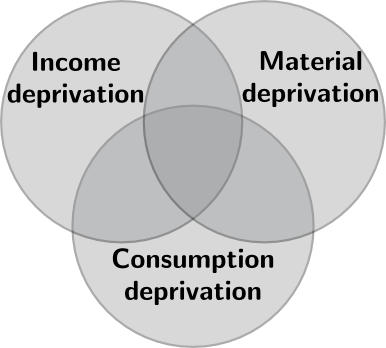

% **Multidimensional deprivation & social cash benefits:**  Evolution of targeting performance of social cash benefits at multidimensionally deprived households in Russian Federation in 2004 - 2011
% Markus Kainu [^*]
% March 15, 2013

<link href="http://markuskainu.fi/material/css/article.css" rel="stylesheet" type="text/css" title="compact"></link>

[^*]:PhD Student. Aleksanteri institute, University of Helsinki & Department of Social Research, University of Turku. Email: <a href="mailto:markuskainu@gmail.com">markuskainu@gmail.com</a>, tel: +358 50 3516164, fax +358 9 191 23615. Website: <a href="http://markuskainu.fi">markuskainu.fi</a>

**keywords:** poverty, income, consumption, material deprivation, targeting, social cash benefits

# Purpose of the study

The social crisis resulted from Russian transition from the socialist system to market economy is far from over. Economic recovery over the last decade has accumulated resources for tackling social problems, but also provided support for the ruling political regime. Poverty rates have been falling in 2000s, but a significant proportion of households are still having incomes below the subsistence minimum. Unlike in poverty rates, there has been no improvements in income inequality, but the rates have varied at high level.

The system of welfare provisions has undergone great changes during the post-socialist period. Yel'tsin time was characterized by small transformations of rusting Soviet system [@fox_safety_2003], whereas Putin's period introduced several welfare reforms in the field of healthcare, pensions, housing and utilities [@cook_postcommunist_2007]. Prime example of the major reforms was so called monetisation of in kind-benefits *(l'goty)* which was implemented in 2005 and followed by extensive demonstrations [@wengle_monetisation_2008]. Since 2005 the welfare reforms have quieted down and their core has shifted towards pro-natalist policies - a development characterized as *shift towards statism* by Linda Cook. [@jappinen_russias_2011] Similarly, recent studies have supported the claims for weak redistributive capacity of social policies in Russian Federation. [e.g., @remington_politics_2011;@denisova_income_2012]

This research combines two crucial issues in this context. First, it operationalises poverty as a multidimensional notion instead uni-dimensional income or consumption measures and second, it analyses the impact of particular monetised welfare provisions, social cash benefits. In other words this study poses a question:  *what effect have the reforms on social benefits made during Putin's second presidential term had on targeting performance of social cash benefits at multidimensionally deprived households?*

# Research Design

This research aims at finding whether social cash benefit schemes are able to meet the households with multiple deprivations and therefore analyses redistributive capacity of social policies. Research setting is cross-sectional at the household level over three points in time: 2004, 2007 and 2011 and utilizes the *RLMS-HSE* data from rounds 13, 16 and 20.

Measure of *social cash benefits* is a monetary composite measure of benefits, allowances and stipends paid on social basis by federal state or local governments. These transfers include subsidies for fuel, child benefits, discounts and subsidies for rent and utilities, pensions, unemployment benefits and other monetary benefits. 

Composition of poverty measure follows the guidelines of so called *multiple overlapping deprivation analysis (MODA)* [@de_neubourg_multiple_2012] and recommendations by OECD [@oecd_handbook_2008]. Multidimensional poverty measure used here is a *composite indice* of set of sub-indicators measuring deprivation in terms of *income*, *consumption* and *material living conditions* as illustrated in figure above. Simple Boolean algebra is used to determine the conjunction or overlap between dimensions. Methodology for coverage, leakage and targeting performance is built on common methodology in development economics [primarily, @coady_targeting_2004] and is applied here in multidimensional setting.

# Expected output

Results provide new insight into poverty reduction capacity of social cash benefits in the Russian Federation and provide new analytical tools for studying the interplay between welfare provision and poverty outcomes in complex welfare systems as in Russian Federation. 

This analysis is descriptive by nature and aims at describing the characteristics and poverty reduction potential of current social cash benefits. This can be useful in analysing the development of Russian welfare state as well as in shaping policies to address  possible shortfalls.

# References

