- [back to index](index.html)

<h1 class="title">Figures for the Moscow paper</h1>


```{rmaterial_comparer20loaddata}
library(ggplot2)
library(plyr)
library(survey)
library(car)
library(reshape2)

#load("~/workspace/russia/rlms/papers/conference2013/data/df_income.RData")


```

```{rmaterial_comparer20opts, echo=FALSE}
opts_chunk$set(echo=TRUE, dev='png', eval=TRUE, cache=TRUE, fig.height=8, fig.width=12, message=FALSE, warning=FALSE)
```


# Macro analysis


```{rmacroplot, cache=TRUE, results='hide', eval=FALSE}
gdp.cur <- read.csv("~/workspace/russia/book_finance/knitr/gdp_current.csv", dec=",")
gdp.cons <- read.csv("~/workspace/russia/book_finance/knitr/gdp_constant.csv", dec=",")
gdp <- join(gdp.cur,gdp.cons,by="Year")
gdp.long <- melt(gdp, id.vars="Year")


library(XML)

url <- "http://www.gks.ru/bgd/regl/b12_12/IssWWW.exe/stg/d01/07-01.htm"
x <- readHTMLTable(url, dec=",", header=TRUE)
n.rows <- unlist(lapply(x, function(t) dim(t)[1]))
df <- x[[which.max(n.rows)]]

#n2 <- df[,1]
# tai siis muokatut
n <- c("Actual final consumption of households(at current prices)",
       "percentage of GDP",
       "percentage to previous year",
       "per capita","Average per capita money income of population (monthly)",
       "Real disposable money income, percentage to previous year",
       "Average accrued monthly wages, employed in the economy",
       "Real accrued wages of an employee, percentage to previous year",
       "Average fixed pension size",
       "Real fixed pension size percentage to previous year",
       "Subsistence minimum level (average per capita):",
       "Subsistence minimum level",
       "Subsistence minimum level to previous year",
       "Subsistence minimum to pensioner",
       "Correlation with subsistence minimum level, percentage:",
       "of per capita \r\nmoney income2)",
       "of average \r\nmonthly accrued \r\nwage",
       "of average fixed \r\npensions3)",
       "Population with money income below subsistence minimum level2):",
       "mln. persons",
       "percentage \r\nof the total \r\npopulation",
       "percentage \r\nto previous \r\nyear",
       "Deficit of money\r\nincome of indigent population 2):",
       "bln. RUR \r\n(before 2000 - \r\ntrln. RUR )",
       "percentage of the \r\ntotal money \r\nincome of \r\npopulation",
       "Coefficient of funds (coefficient of \r\ndifferentiation of \r\nincome)2), times",
       "Minimum wages (annual average)",
       "Real minimum wages, percentage to previous year")
#
df <- as.data.frame(t(df[,-1]))
names(df) <- n

df.plot <- subset(df, 
                  select=c("Average per capita money income of population (monthly)",
"Average accrued monthly wages, employed in the economy",
"Average fixed pension size",
"Subsistence minimum level",
"Minimum wages (annual average)"))

#names(df.plot) <- "Average.per.capita.monthly.income"
Year <- c(1992,1995,2000,2005,2007,2008,2009,2010,2011)
df.plot <- cbind(df.plot,Year)
df.plot.l <- melt(df.plot, id.vars="Year")

df.plot <- cbind(df.plot,Year)
df.plot.l <- melt(df.plot, id.vars="Year")
df.plot.l$value <- factor(df.plot.l$value)
df.plot.l$value <- recode(df.plot.l$value, "'12104)'='1210';
                          '30185)'='3018'")
df.plot.l$value.num <- as.numeric(levels(df.plot.l$value)[df.plot.l$value])
df.plot.l <- subset(df.plot.l, Year >= 2000)

wages.long <- df.plot.l

names(gdp.long) <- c("Year","variable.gdp","value.gdp")
df <- join(gdp.long,wages.long,by="Year")
df <- subset(df, variable.gdp %in% 'GDP.in.current.prices')
df <- subset(df, variable %in% 'Average accrued monthly wages, employed in the economy')
df <- subset(df, Year >= 2000)
#
pl1 <- ggplot(df, aes(x=value.gdp, y=value.num, label=Year)) + 
  geom_point(shape=1, size=1.5) + geom_path() + geom_text(size=2, hjust=0.0, vjust=-0.5) +
  #geom_smooth(method=lm, se=FALSE) +
  labs(x = "GDP in Billion US$", y = "Roubles per Month",title="GDP vs. average wages") +
  coord_cartesian(ylim = c(1000, 25000), xlim = c(5000, 60000)) +
  theme_minimal() +
  theme(axis.title.y = element_text(size=6)) +
  theme(axis.title.x = element_text(size=6)) +
  theme(axis.text.y = element_text(size=6)) +
  theme(axis.text.x = element_text(size=6)) +
  theme(title = element_text(size=7))
#
df <- join(gdp.long,wages.long,by="Year")
df <- subset(df, variable.gdp %in% 'GDP.in.current.prices')
df <- subset(df, variable %in% 'Average fixed pension size')
df <- subset(df, Year >= 2000)
#

pl2 <- ggplot(df, aes(x=value.gdp, y=value.num, label=Year)) + 
  geom_point(shape=1, size=1.5) + geom_path() + geom_text(size=2, hjust=0.0, vjust=-0.5) +
  #geom_smooth(method=lm, se=FALSE) +
  labs(x = "GDP in Billion US$", y = "Roubles per Month",title="GDP vs. average pension size") +
  coord_cartesian(ylim = c(0, 10000), xlim = c(5000, 60000))  +
  theme_minimal() +
  theme(axis.title.y = element_text(size=6)) +
  theme(axis.title.x = element_text(size=6)) +
  theme(axis.text.y = element_text(size=6)) +
  theme(axis.text.x = element_text(size=6)) +
  theme(title = element_text(size=7))
#
df <- join(gdp.long,wages.long,by="Year")
df <- subset(df, variable.gdp %in% 'GDP.in.current.prices')
df <- subset(df, variable %in% 'Minimum wages (annual average)')
df <- subset(df, Year >= 2000)
#
pl3 <- ggplot(df, aes(x=value.gdp, y=value.num, label=Year)) + 
  geom_point(shape=1, size=1.5) + geom_path() + geom_text(size=2, hjust=0.0, vjust=-0.5) +
  #geom_smooth(method=lm, se=FALSE) +
  labs(x = "GDP in Billion US$", y = "Roubles per Month",title="GDP vs. annual average minimun wage") +
  theme(axis.title.x = element_text(size=13),
        axis.title.y  = element_text(angle=90, size=13)) +
  coord_cartesian(ylim = c(0, 6500), xlim = c(5000, 60000)) +
  theme_minimal() +
  theme(axis.title.y = element_text(size=6)) +
  theme(axis.title.x = element_text(size=6)) +
  theme(axis.text.y = element_text(size=6)) +
  theme(axis.text.x = element_text(size=6)) +
  theme(title = element_text(size=7))
#
df <- join(gdp.long,wages.long,by="Year")
df <- subset(df, variable.gdp %in% 'GDP.in.current.prices')
df <- subset(df, variable %in% 'Subsistence minimum level')
df <- subset(df, Year >= 2000)
#
pl4 <- ggplot(df, aes(x=value.gdp, y=value.num, label=Year)) + 
  geom_point(shape=1, size=1.5) + geom_path() + geom_text(size=2, hjust=0.0, vjust=-0.5) +
  #geom_smooth(method=lm, se=FALSE) +
  labs(x = "GDP in Billion US$", y = "Roubles per Month",title="GDP vs. level of subsistence minimun") +
  coord_cartesian(ylim = c(0, 7500), xlim = c(5000, 60000)) +
  theme_minimal() +
  theme(axis.title.y = element_text(size=6)) +
  theme(axis.title.x = element_text(size=6)) +
  theme(axis.text.y = element_text(size=6)) +
  theme(axis.text.x = element_text(size=6)) +
  theme(title = element_text(size=7))

pdf("figure/macroplot.pdf", width=12/2.54, height=14/2.54)
library(grid)
grid.newpage()
pushViewport(viewport(layout=grid.layout(2,2)))
print(pl1, vp=viewport(layout.pos.row=1, layout.pos.col=1))
print(pl2, vp=viewport(layout.pos.row=1, layout.pos.col=2))
print(pl3, vp=viewport(layout.pos.row=2, layout.pos.col=1))
print(pl4, vp=viewport(layout.pos.row=2, layout.pos.col=2))
dev.off()

#

ppi <- 300
png("figure/macroplot_slide1.png", width=12/2.54*ppi, height=7/2.54*ppi, res=ppi)
library(grid)
grid.newpage()
pushViewport(viewport(layout=grid.layout(1,2)))
print(pl1, vp=viewport(layout.pos.row=1, layout.pos.col=1))
print(pl2, vp=viewport(layout.pos.row=1, layout.pos.col=2))
dev.off()


ppi <- 300
png("figure/macroplot_slide2.png", width=12/2.54*ppi, height=7/2.54*ppi, res=ppi)
library(grid)
grid.newpage()
pushViewport(viewport(layout=grid.layout(1,2)))
print(pl3, vp=viewport(layout.pos.row=1, layout.pos.col=1))
print(pl4, vp=viewport(layout.pos.row=1, layout.pos.col=2))
dev.off()

```

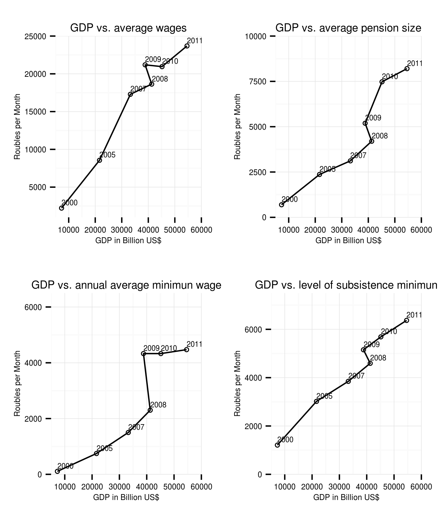

- [Load as vector .pdf](figure/macroplot.pdf)
- [Load as bitmap .png](figure/macroplot.png)


# Poverty

## Income poverty
```{rpovplot,  cache=TRUE, results='hide'}

load("data/df_income.RData")

# copied form here: http://www.gks.ru/bgd/regl/b08_12/IssWWW.exe/stg/d01/07-11.htm
# and here: http://www.gks.ru/bgd/regl/b12_12/IssWWW.exe/stg/d01/07-11.htm

subsistence <- c(1210,1500,1808,2112,2376,3018,3422,3847,4593,5153,5688,6369)
year <- 2000:2011
povrates.rt <- data.frame(year,subsistence)
df <- merge(df,povrates.rt,by="year")
df$rt.poor[df$income_eq <= df$subsistence] <- "poor"
df$rt.poor[df$income_eq > df$subsistence] <- "non.poor"
df$rt.poor <- factor(df$rt.poor)

library(survey)
d.df <- svydesign(id = ~id, weights = ~weight, data = df)

t2 <- data.frame(prop.table(svytable(~rt.poor + year, d.df), 2) * 100)
t3 <- subset(t2, rt.poor %in% "poor")
t3$Freq <- round(t3$Freq, 1)
t3$group <- "poverty.rate"
t3$rt.poor <- NULL

library(laeken)
arpr2000 <- arpr("income_eq", weights = "weight", data = subset(df, year == 2000), 
    p = 0.6, na.rm = TRUE)
arpr2001 <- arpr("income_eq", weights = "weight", data = subset(df, year == 2001), 
    p = 0.6, na.rm = TRUE)
arpr2002 <- arpr("income_eq", weights = "weight", data = subset(df, year == 2002), 
    p = 0.6, na.rm = TRUE)
arpr2003 <- arpr("income_eq", weights = "weight", data = subset(df, year == 2003), 
    p = 0.6, na.rm = TRUE)
arpr2004 <- arpr("income_eq", weights = "weight", data = subset(df, year == 2004), 
    p = 0.6, na.rm = TRUE)
arpr2005 <- arpr("income_eq", weights = "weight", data = subset(df, year == 2005), 
    p = 0.6, na.rm = TRUE)
arpr2006 <- arpr("income_eq", weights = "weight", data = subset(df, year == 2006), 
    p = 0.6, na.rm = TRUE)
arpr2007 <- arpr("income_eq", weights = "weight", data = subset(df, year == 2007), 
    p = 0.6, na.rm = TRUE)
arpr2008 <- arpr("income_eq", weights = "weight", data = subset(df, year == 2008), 
    p = 0.6, na.rm = TRUE)
arpr2009 <- arpr("income_eq", weights = "weight", data = subset(df, year == 2009), 
    p = 0.6, na.rm = TRUE)
arpr2010 <- arpr("income_eq", weights = "weight", data = subset(df, year == 2010), 
    p = 0.6, na.rm = TRUE)
arpr2011 <- arpr("income_eq", weights = "weight", data = subset(df, year == 2011), 
    p = 0.6, na.rm = TRUE)

Freq <- unlist(c(arpr2000$value,arpr2001$value,arpr2002$value,arpr2003$value,arpr2004$value,arpr2005$value,arpr2006$value,arpr2007$value,arpr2008$value,arpr2009$value,arpr2010$value,arpr2011$value))
year <- 2000:2011
povdata <- data.frame(year,Freq)
povdata$group <- "relative.poverty.rate"
povdata$Freq <- round(povdata$Freq, 1)
povertydata <- rbind(povdata,t3)

povertydata$year <- factor(povertydata$year)
povertydata$year <- as.numeric(levels(povertydata$year))[povertydata$year]
cnames <- subset(povertydata, year == 2011)

povplot <- ggplot(povertydata, aes(x=year, y=Freq, label=Freq, color=group, group=group)) +
  geom_point(shape=1, size=2) + geom_path() + geom_text(vjust=-1, size=2) +
  geom_text(data=cnames, aes(x=year, y=Freq, label=group, color=group), hjust=1, vjust=1, size=2.4) +
  theme_minimal() +
  coord_cartesian(xlim=c(1999,2012), ylim=c(0,50)) +
  theme(legend.position="none") +
 theme(axis.title.y = element_text(size=6)) +
  theme(axis.title.x = element_text(size=6)) +
  theme(axis.text.y = element_text(size=6)) +
  theme(axis.text.x = element_text(size=6)) +
  scale_color_manual(values=c("#999999", "#E69F00"))  +
  geom_vline(aes(xintercept=2005), colour="Dim Grey", linetype="dashed") +
  annotate("text", x = 2005, y = 35, label = "introduction of MCP", size=2, color="Dim Grey")  +
  scale_x_continuous(breaks = 2000:2011)
  

pdf("figure/povplot.pdf", width=12/2.54, height=8/2.54)
povplot
dev.off()

ppi <- 300
png("figure/povplot.png", width=12/2.54*ppi, height=8/2.54*ppi, res=ppi)
povplot
dev.off()

df.income <- df
# rm(list=setdiff(ls(), "df.income"))
```

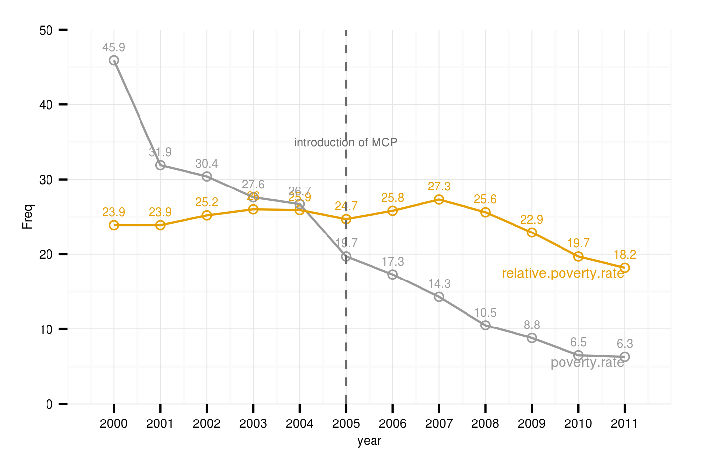

- [Load as vector .pdf](figure/povplot.pdf)
- [Load as bitmap .png](figure/povplot.png)

## Consumption poverty

```{rconsumption,  cache=TRUE, results='hide'}
library(car)
load("data/df_consumption.RData")

df$cp <- df$f16.1.rec+df$f16.2.rec+df$f16.3.rec+df$f16.4.rec

df$cpoor[df$cp >= 1] <- 'poor'
df$cpoor[df$cp == 0] <- 'non.poor'

df$outpatient[df$f16.1.rec == 1] <- 'poor' 
df$outpatient[df$f16.1.rec != 1] <- 'non.poor' 
df$hospital[df$f16.2.rec == 1] <- 'poor' 
df$hospital[df$f16.2.rec != 1] <- 'non.poor' 
df$dental[df$f16.3.rec == 1] <- 'poor' 
df$dental[df$f16.3.rec != 1] <- 'non.poor' 
df$drugs[df$f16.4.rec == 1] <- 'poor' 
df$drugs[df$f16.4.rec != 1] <- 'non.poor' 


library(survey)
d.df <- svydesign(id = ~id, weights = ~weight, data = df)


library(plyr)
consumption <- data.frame(prop.table(svytable(~cpoor + year, d.df), 2) * 100)
consumption$type <- "consumption.joint"
consumption <- rename(consumption, c("cpoor" = "poor"))
outpatient <- data.frame(prop.table(svytable(~outpatient + year, d.df), 2) * 100)
outpatient$type <- "outpatient.care"
outpatient <- rename(outpatient, c("outpatient" = "poor"))
hospital <- data.frame(prop.table(svytable(~hospital + year, d.df), 2) * 100)
hospital$type <- "hospital.care"
hospital <- rename(hospital, c("hospital" = "poor"))
dental <- data.frame(prop.table(svytable(~dental + year, d.df), 2) * 100)
dental$type <- "dental.care"
dental <- rename(dental, c("dental"="poor"))
drugs <- data.frame(prop.table(svytable(~drugs + year, d.df), 2) * 100)
drugs$type <- "medicine"
drugs <- rename(drugs, c("drugs"="poor"))

consdata <- rbind(consumption,outpatient,hospital,dental,drugs)
consdata <- subset(consdata, poor =='poor')
consdata$Freq <- round(consdata$Freq, 1)

library(grid)
consdata$year <- factor(consdata$year)
consdata$year <- as.numeric(levels(consdata$year))[consdata$year]
cnames <- subset(consdata, year==2002)
consplot <- ggplot(consdata, aes(x=year, y=Freq, 
                                 color=type, 
                                 group=type, 
                                 label=Freq)) +
  geom_point(shape=1, size=2) + geom_line() +
  geom_text(size=2, vjust=-1) +
  geom_text(data=cnames, aes(x=year, y=Freq, 
                             color=type, group=type, 
                             label=type), size=2, 
            hjust=0, vjust=3) +
  theme_minimal() +
  theme(axis.title.y = element_text(size=6)) +
  theme(axis.title.x = element_text(size=6)) +
  theme(axis.text.y = element_text(size=6)) +
  theme(axis.text.x = element_text(size=6)) +
  scale_color_manual(values=c("#999999", "#E69F00", "#56B4E9", "#009E73","#D55E00", "#CC79A7","#0072B2","#F0E442")) +
  theme(legend.position="none") +
  theme(legend.title=element_blank()) +
  theme(legend.text=element_text(size=6)) +
  guides(color = guide_legend(nrow = 2)) +
  theme(legend.key.size = unit(3, "mm")) +
  geom_vline(aes(xintercept=2005), colour="Dim Grey", linetype="dashed") +
  annotate("text", x = 2005, y = 25, 
           label = "introduction of MCP", size=2, color="Dim Grey")   +
  scale_x_continuous(breaks = 2000:2011)
  

pdf("figure/consplot.pdf", width=12/2.54, height=8/2.54)
consplot
dev.off()

ppi <- 300
png("figure/consplot.png", width=12/2.54*ppi, height=8/2.54*ppi, res=ppi)
consplot
dev.off()

df.consumption <- df

# rm(list=setdiff(ls(), c("df.income","df.consumption")))
```

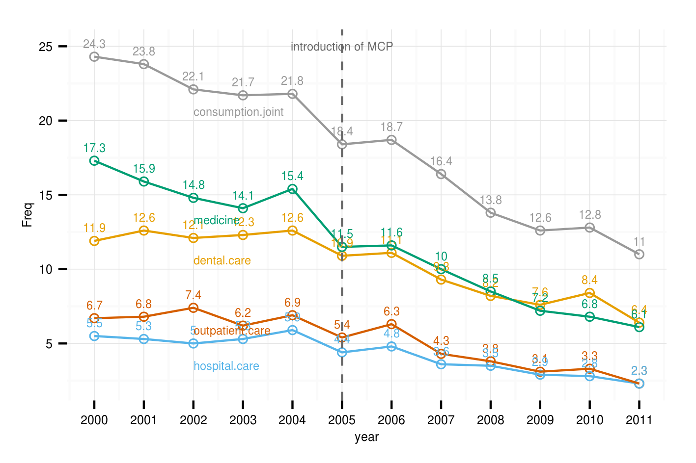

- [Load as vector .pdf](figure/consplot.pdf)
- [Load as bitmap .png](figure/consplot.png)

## Material deprivation


```{rmaterial,  cache=TRUE, results='hide'}

load("data/df_material.RData")


df$md.sum <-  #df$fridge.rec+
              df$tv.rec+
              df$water.rec+
              df$hotwater.rec+
              df$sewage.rec+
              #df$phone.rec+
              df$computer.rec

df$md.poor[df$md.sum > 2] <- 'poor'
df$md.poor[df$md.sum < 3] <- 'non.poor'
df$md.poor <- factor(df$md.poor)

library(survey)
d.df <- svydesign(id = ~id, weights = ~weight, data = df)

md.poor <- data.frame(prop.table(svytable(~md.poor + year, d.df), 2) * 100)
md.poor$type <- "material.joint"
md.poor <- rename(md.poor, c("md.poor" = "poor"))
md.tv <- data.frame(prop.table(svytable(~md.tv + year, d.df), 2) * 100)
md.tv$type <- "lack.of.tv"
md.tv <- rename(md.tv, c("md.tv" = "poor"))
md.water <- data.frame(prop.table(svytable(~md.water + year, d.df), 2) * 100)
md.water$type <- "lack.of.water"
md.water <- rename(md.water, c("md.water" = "poor"))
md.hotwater <- data.frame(prop.table(svytable(~md.hotwater + year, d.df), 2) * 100)
md.hotwater$type <- "lack.of.hotwater"
md.hotwater <- rename(md.hotwater, c("md.hotwater" = "poor"))
md.sewage <- data.frame(prop.table(svytable(~md.sewage + year, d.df), 2) * 100)
md.sewage$type <- "lack.of.sewage"
md.sewage <- rename(md.sewage, c("md.sewage" = "poor"))
md.computer <- data.frame(prop.table(svytable(~md.computer + year, d.df), 2) * 100)
md.computer$type <- "lack.of.computer"
md.computer <- rename(md.computer, c("md.computer" = "poor"))

matdata <- rbind(md.poor,md.tv,md.water,md.hotwater,md.sewage,md.computer)
matdata <- subset(matdata, poor =='poor')
matdata$Freq <- round(matdata$Freq, 1)

library(grid)
matdata$year <- factor(matdata$year)
matdata$year <- as.numeric(levels(matdata$year))[matdata$year]
cnames <- subset(matdata, year==2011)
materplot <- ggplot(matdata, aes(x=year, y=Freq, color=type, 
                                 group=type, label=Freq)) +
  geom_point(shape=1, size=2) + geom_line() +
  geom_text(size=2, vjust=-1) +
  geom_text(data=cnames, aes(x=year, y=Freq, color=type, 
                             group=type, label=type), size=2, hjust=-0.1, vjust=1) +
  theme_minimal() +
  theme(axis.title.y = element_text(size=6)) +
  theme(axis.title.x = element_text(size=6)) +
  theme(axis.text.y = element_text(size=6)) +
  theme(axis.text.x = element_text(size=6)) +
  scale_color_manual(values=c("#999999", "#E69F00", "#56B4E9", "#009E73","#D55E00", "#CC79A7","#0072B2","#F0E442")) +
  theme(legend.position="none") +
  theme(legend.title=element_blank()) +
  theme(legend.text=element_text(size=6)) +
  guides(color = guide_legend(nrow = 2)) +
  theme(legend.key.size = unit(3, "mm"))  +
  geom_vline(aes(xintercept=2005), colour="Dim Grey", linetype="dashed") +
  annotate("text", x = 2005, y = 50, label = "introduction of MCP", size=2, color="Dim Grey")  +
  scale_x_continuous(breaks = 2000:2011) +
  coord_cartesian(xlim=c(2000,2013))
  
pdf("figure/materplot.pdf", width=12/2.54, height=8/2.54)
materplot
dev.off()

ppi <- 300
png("figure/materplot.png", width=12/2.54*ppi, height=8/2.54*ppi, res=ppi)
materplot
dev.off()

df.material <- df
# rm(list=setdiff(ls(), c("df.income","df.consumption","df.material")))
```

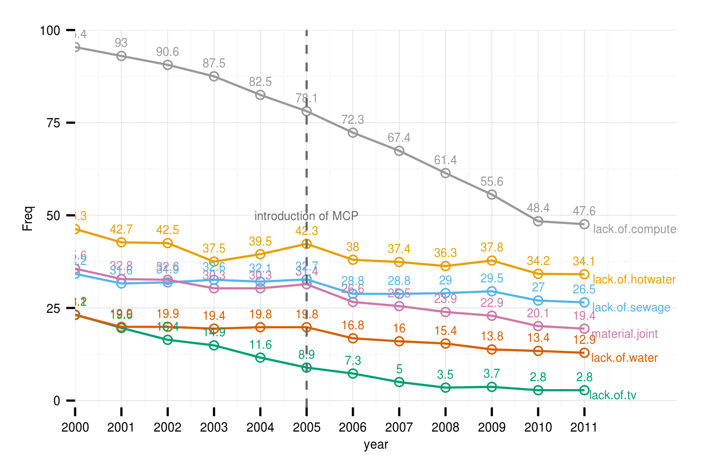

- [Load as vector .pdf](figure/materplot.pdf)
- [Load as bitmap .png](figure/materplot.png)

## Dimensions combined

```{rmultidim1,  cache=TRUE, results='hide', eval=FALSE}
df.consumption$income <- NULL
df.material$income <- NULL

df.x <- merge(df.income,df.consumption, by=c("year","hh_size","psu","id","round","year","psu_txt","weight"))
df.x <- merge(df.x,df.material, by=c("year","hh_size","psu","id","round","year","psu_txt","weight"))

# rm(list=setdiff(ls(), "df.x"))


df.x$multi.poor <- NULL

df.x$multi.poor[df.x$cpoor == 'poor' & df.x$md.poor == 'poor' & df.x$rt.poor == 'poor'] <- 'all.poor'
df.x$multi.poor[df.x$cpoor == 'poor' & df.x$md.poor == 'poor' & df.x$rt.poor != 'poor'] <- 'consumption_material.poor'
df.x$multi.poor[df.x$cpoor == 'poor' & df.x$md.poor != 'poor' & df.x$rt.poor == 'poor'] <- 'consumption_income.poor'
df.x$multi.poor[df.x$cpoor != 'poor' & df.x$md.poor == 'poor' & df.x$rt.poor == 'poor'] <- 'material_income.poor'
df.x$multi.poor[df.x$cpoor != 'poor' & df.x$md.poor != 'poor' & df.x$rt.poor == 'poor'] <- 'only_income.poor'
df.x$multi.poor[df.x$cpoor != 'poor' & df.x$md.poor == 'poor' & df.x$rt.poor != 'poor'] <- 'only_material.poor'
df.x$multi.poor[df.x$cpoor == 'poor' & df.x$md.poor != 'poor' & df.x$rt.poor != 'poor'] <- 'only_consumption.poor'
df.x$multi.poor[df.x$cpoor != 'poor' & df.x$md.poor != 'poor' & df.x$rt.poor != 'poor'] <- 'non.poor'

table(df.x$year,df.x$multi.poor)

library(survey)
d.df <- svydesign(id = ~id, weights = ~weight, data = df.x)

multi.poor <- data.frame(prop.table(svytable(~multi.poor + year, d.df), 2) * 100)
multidata <- subset(multi.poor, multi.poor != 'non.poor')
multidata$Freq <- round(multidata$Freq, 1)

cnames <- subset(multidata, year==2011)
multidata$year <- as.numeric(levels(multidata$year))[multidata$year]
multidimplot <- ggplot(multidata, aes(x=year, y=Freq, color=multi.poor, group=multi.poor, label=Freq)) +
  geom_point(shape=1, size=2) + geom_line() +
  geom_text(size=2, vjust=-1) +
  #geom_text(data=cnames, aes(x=year, y=Freq, color=type, group=type, label=type), size=2, hjust=1, vjust=1) +
  theme_minimal() +
  theme(axis.title.y = element_text(size=6)) +
  theme(axis.title.x = element_text(size=6)) +
  theme(axis.text.y = element_text(size=6)) +
  theme(axis.text.x = element_text(size=6)) +
  scale_color_manual(values=c("#999999", "#E69F00", "#56B4E9", "#009E73","#D55E00", "#CC79A7","#0072B2","#F0E442")) +
  theme(legend.position="top") +
  theme(legend.title=element_blank()) +
  theme(legend.text=element_text(size=6)) +
  guides(color = guide_legend(nrow = 2)) +
  theme(legend.key.size = unit(3, "mm")) +
  geom_vline(aes(xintercept=2005), colour="Dim Grey", linetype="dashed") +
  annotate("text", x = 2005, y = 1, 
           label = "introduction of MCP", size=2, color="Dim Grey") +
  scale_x_continuous(breaks = 2000:2011)

pdf("figure/multidimplot.pdf", width=12/2.54, height=8/2.54)
multidimplot
dev.off()

ppi <- 300
png("figure/multidimplot.png", width=12/2.54*ppi, height=8/2.54*ppi, res=ppi)
multidimplot
dev.off()

```

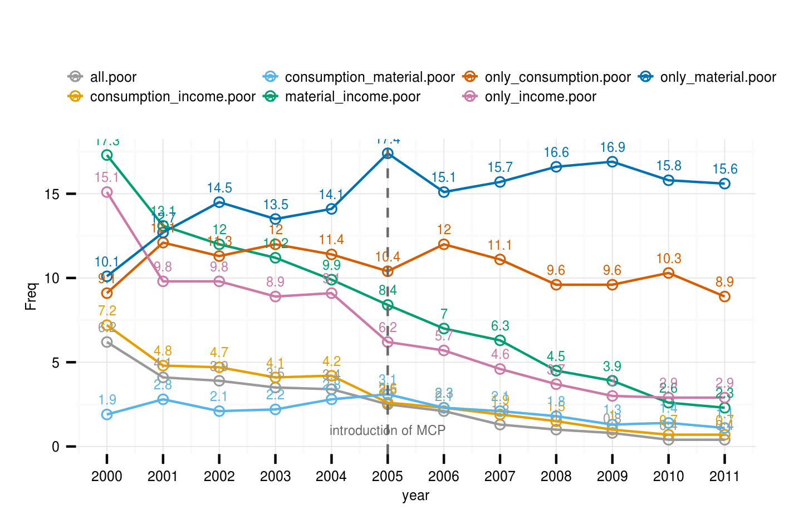

- [Load as vector .pdf](figure/multidimplot.pdf)
- [Load as bitmap .png](figure/multidimplot.png)

## multidimensional by psu

```{rmultidim2,  cache=TRUE, results='hide', eval=FALSE}
df.consumption$income <- NULL
df.material$income <- NULL

df.x <- merge(df.income,df.consumption, by=c("year","hh_size","psu","id","round","year","psu_txt","weight"))
df.x <- merge(df.x,df.material, by=c("year","hh_size","psu","id","round","year","psu_txt","weight"))

# rm(list=setdiff(ls(), "df.x"))


df.x$multi.poor <- NULL

df.x$multi.poor[df.x$cpoor == 'poor' & df.x$md.poor == 'poor' & df.x$rt.poor == 'poor'] <- 'all.poor'
df.x$multi.poor[df.x$cpoor == 'poor' & df.x$md.poor == 'poor' & df.x$rt.poor != 'poor'] <- 'consumption_material.poor'
df.x$multi.poor[df.x$cpoor == 'poor' & df.x$md.poor != 'poor' & df.x$rt.poor == 'poor'] <- 'consumption_income.poor'
df.x$multi.poor[df.x$cpoor != 'poor' & df.x$md.poor == 'poor' & df.x$rt.poor == 'poor'] <- 'material_income.poor'
df.x$multi.poor[df.x$cpoor != 'poor' & df.x$md.poor != 'poor' & df.x$rt.poor == 'poor'] <- 'only_income.poor'
df.x$multi.poor[df.x$cpoor != 'poor' & df.x$md.poor == 'poor' & df.x$rt.poor != 'poor'] <- 'only_material.poor'
df.x$multi.poor[df.x$cpoor == 'poor' & df.x$md.poor != 'poor' & df.x$rt.poor != 'poor'] <- 'only_consumption.poor'
df.x$multi.poor[df.x$cpoor != 'poor' & df.x$md.poor != 'poor' & df.x$rt.poor != 'poor'] <- 'non.poor'


# multidim
library(car)
library(reshape2)
df.x$true.poor <- recode(df.x$multi.poor, 
                         "c('all.poor',
                            'consumption_income.poor',
                            'consumption_material.poor',
                            'material_income.poor')='poor';
                             else='non.poor'")
library(survey)
d.df <- svydesign(id = ~id, weights = ~weight, data = df.x)


r <- data.frame(svytable(~year + psu + true.poor,d.df))
rl <- dcast(r, psu + year ~ true.poor, value.var="Freq")
rl$poverty.rate <- rl$poor/ (rl$poor + rl$non.poor) *100

region <- read.csv("~/workspace/general/region_coding/rus_rlms.csv")
df <- merge(rl,region[,5:6],by="psu")


nat <- data.frame(prop.table(svytable(~year + true.poor,d.df),1)*100)
nat <- subset(nat, true.poor == 'poor')
nat$Freq <- round(nat$Freq,1)
nat$year <- as.numeric(levels(nat$year))[nat$year]

df$year <- as.numeric(levels(df$year))[df$year]
df$poverty.rate <- round(df$poverty.rate, 1)
cnames <- subset(df, year==2000)
multidimplotpsu <- ggplot(df, aes(x=year, y=poverty.rate, color=psu_txt, 
                               group=psu_txt, label=poverty.rate)) +
  geom_point(shape=1, size=2) + geom_line() +
  geom_text(size=2, vjust=-1) +
  geom_text(data=cnames, 
            aes(x=year, y=poverty.rate, color=psu_txt, group=psu_txt,
                label=psu_txt), size=1.5, hjust=1, vjust=1) +
  theme_minimal() +
  theme(axis.title.y = element_text(size=6)) +
  theme(axis.title.x = element_text(size=6)) +
  theme(axis.text.y = element_text(size=6)) +
  theme(axis.text.x = element_text(size=6)) +
  theme(legend.position="none") +
  theme(legend.title=element_blank()) +
  theme(legend.text=element_text(size=6)) +
  geom_vline(aes(xintercept=2005), colour="Dim Grey", linetype="dashed") +
  annotate("text", x = 2005, y = 70, 
           label = "introduction of MCP", size=2, color="Dim Grey") +
  scale_x_continuous(breaks = 2000:2011) +
 coord_cartesian(xlim=c(1996,2011))

pdf("figure/multidimplotpsu.pdf", width=12/2.54, height=8/2.54)
multidimplotpsu
dev.off()

ppi <- 300
png("figure/multidimplotpsu.png", width=12/2.54*ppi, height=8/2.54*ppi, res=ppi)
multidimplotpsu
dev.off()

```

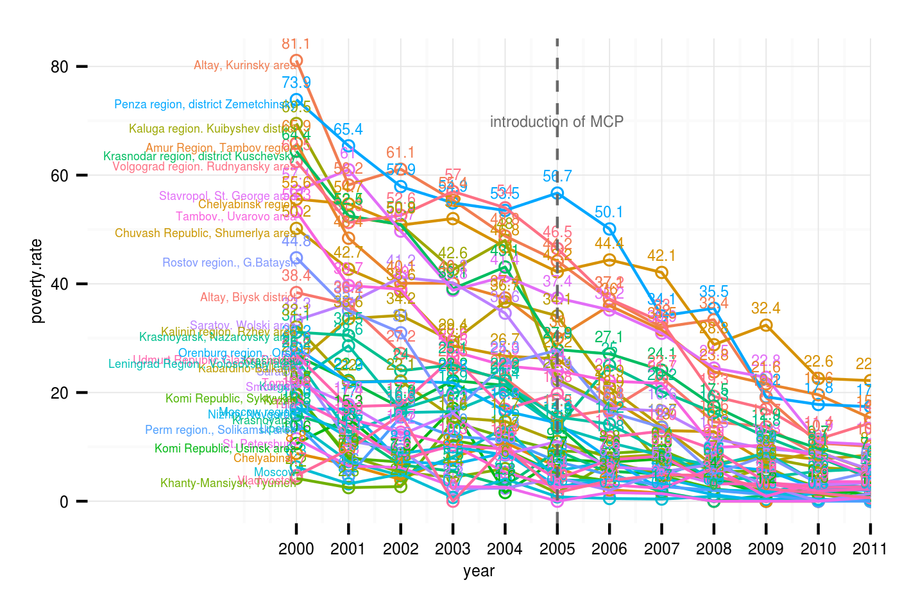

- [Load as vector .pdf](figure/multidimplotpsu.pdf)
- [Load as bitmap .png](figure/multidimplotpsu.png)

# Targeting performance of Monthly Cash Payments

## Coverage/leakage

### All categories

```{rcovplot, results='hide', eval=FALSE}
## Mean benefit

load("data/df_cashbenefits.RData")

df$f12.1aa[df$round < 14] <- 2
cdata <- ddply(df, .(year), summarise, 
              N    = length(f12.1aa),
              mean = mean(f12.1aa, na.rm=TRUE))

#df.13 <- subset(df, round > 13)

df.z <- merge(df.x,df, 
              by=c("year","hh_size","psu","id","round","weight"), 
              all.x=TRUE)

d.df <- svydesign(id = ~id, weights = ~weight, data = df.z)

t2 <- data.frame(svytable(~multi.poor+f12.1aa+year,d.df))
names(t2) <- c("poor","coverage","year","Freq")
t2 <- subset(t2, coverage != 99999999)
t2$coverage <- recode(t2$coverage, "1='covered';
                                    2='non.covered'")
t2w <- dcast(t2, year ~ coverage + poor, value.var="Freq")

t2w$cov.all.poor <- t2w$covered_all.poor / (t2w$non.covered_all.poor + t2w$covered_all.poor) * 100
t2w$cov.consumption_income.poor <- t2w$covered_consumption_income.poor / (t2w$non.covered_consumption_income.poor + t2w$covered_consumption_income.poor) * 100
t2w$cov.consumption_material.poor <- t2w$covered_consumption_material.poor / (t2w$non.covered_consumption_material.poor + t2w$covered_consumption_material.poor) * 100
t2w$cov.material_income.poor <- t2w$covered_material_income.poor / (t2w$non.covered_material_income.poor + t2w$covered_material_income.poor) * 100
t2w$cov.only_consumption.poor <- t2w$covered_only_consumption.poor / (t2w$non.covered_only_consumption.poor + t2w$covered_only_consumption.poor) * 100
t2w$cov.only_income.poor <- t2w$covered_only_income.poor / (t2w$non.covered_only_income.poor + t2w$covered_only_income.poor) * 100
t2w$cov.only_material.poor <- t2w$covered_only_material.poor / (t2w$non.covered_only_material.poor + t2w$covered_only_material.poor) * 100
t2w$cov.non.poor <- t2w$covered_non.poor / (t2w$non.covered_non.poor + t2w$covered_non.poor) * 100

t2.x <- t2w[, c(1,18:25)]
t2.x.l <- melt(t2.x, id.vars="year")

t2.x.l$value <- round(t2.x.l$value, 1)

t2.x.l$year <- as.numeric(levels(t2.x.l$year))[t2.x.l$year]

covplot <- ggplot(t2.x.l, aes(x=year, y=value, color=variable, label=value, group=variable)) +
  geom_point(shape=1, size=2) + geom_line() +
  geom_text(size=2, vjust=-1) +
  #geom_text(data=cnames, aes(x=year, y=Freq, color=type, group=type, label=type), size=2, hjust=1, vjust=1) +
  theme_minimal() +
  theme(axis.title.y = element_text(size=6)) +
  theme(axis.title.x = element_text(size=6)) +
  theme(axis.text.y = element_text(size=6)) +
  theme(axis.text.x = element_text(size=6)) +
  scale_color_manual(values=c("#999999", "#E69F00", "#56B4E9", "#009E73","#D55E00", "#CC79A7","#0072B2","#F0E442")) +
  theme(legend.position="top") +
  theme(legend.title=element_blank()) +
  theme(legend.text=element_text(size=6)) +
  guides(color = guide_legend(nrow = 2)) +
  theme(legend.key.size = unit(3, "mm")) +
  geom_vline(aes(xintercept=2005), colour="Dim Grey", linetype="dashed") +
  annotate("text", x = 2005, y = 35, label = "introduction of MCP", size=2, color="Dim Grey")

pdf("figure/covplot.pdf", width=12/2.54, height=8/2.54)
covplot
dev.off()

ppi <- 300
png("figure/covplot.png", width=12/2.54*ppi, height=8/2.54*ppi, res=ppi)
covplot
dev.off()

```

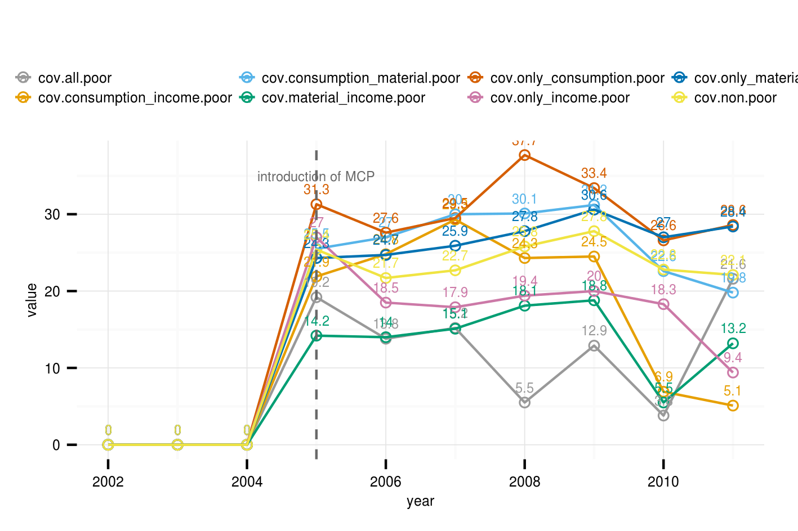

- [Load as vector .pdf](figure/covplot.pdf)
- [Load as bitmap .png](figure/covplot.png)

### Area plots on individual on joint category

```{rcoverageplot}

df.z$recipient <- 'not.covered'
df.z$recipient[df.z$f12.1aa == 1] <- 'covered'
df.z$recipient[df.z$f12.1aa != 1] <- 'not.covered'

d.df <- svydesign(id = ~id, weights = ~weight, data = df.z)

# income poverty

r <- data.frame(svytable(~year + rt.poor + recipient,d.df))
names(r) <- c("Var1","Var2","Var3","Freq")
rl <- dcast(r, Var1 ~ Var2 + Var3, value.var="Freq")
rl$sum <- rl$non.poor_covered+rl$non.poor_not.covered+rl$poor_covered+rl$poor_not.covered
rl$povrate <- (rl$poor_covered + rl$poor_not.covered)/rl$sum * 100
rl$cov_poor <- rl$poor_covered / rl$sum * 100
rl$coverage <- rl$poor_covered / (rl$poor_covered + rl$poor_not.covered) * 100
rl$leakage <- rl$non.poor_covered / (rl$non.poor_covered + rl$non.poor_not.covered) * 100
rl$non.povrate <- (rl$non.poor_covered + rl$non.poor_not.covered)/rl$sum * 100
h <- rl[,c(1,7:11)]
h$Var1 <- as.numeric(levels(h$Var1))[h$Var1]

h[,2:3] <- round(h[,2:3], 1)
plot1 <- ggplot(h, aes(x=Var1)) + 
  geom_area(aes(y=povrate, alpha=0.7), fill="#56B4E9") + 
  geom_area(aes(y=cov_poor, alpha=0.7), fill="#E69F00") +
  geom_point(aes(y=povrate), shape=1, size=1) +
  geom_point(aes(y=cov_poor), shape=1, size=1) +
  geom_text(aes(y=povrate, label=povrate), size=2, vjust=-1) +
  geom_text(aes(y=cov_poor, label=cov_poor), size=2, vjust=-1) +
  theme_minimal() +
  theme(axis.title.y = element_text(size=6)) +
  theme(axis.title.x = element_text(size=6)) +
  theme(axis.text.y = element_text(size=6)) +
  theme(axis.text.x = element_text(size=6)) +
  theme(legend.position="none") +
  theme(legend.title=element_blank()) +
  theme(legend.text=element_text(size=6)) +
  labs(title="income poverty") +
  theme(title = element_text(size=7)) +
  coord_cartesian(ylim=c(0,50)) +
  geom_vline(aes(xintercept=2005), colour="Dim Grey", linetype="dashed") +
  annotate("text", x = 2005, y = 40, label = "introduction of MCP", size=2, color="Dim Grey")

# consumption
r <- data.frame(svytable(~year + cpoor + recipient,d.df))
names(r) <- c("Var1","Var2","Var3","Freq")
rl <- dcast(r, Var1 ~ Var2 + Var3, value.var="Freq")
rl$sum <- rl$non.poor_covered+rl$non.poor_not.covered+rl$poor_covered+rl$poor_not.covered
rl$povrate <- (rl$poor_covered + rl$poor_not.covered)/rl$sum * 100
rl$cov_poor <- rl$poor_covered / rl$sum * 100
rl$coverage <- rl$poor_covered / (rl$poor_covered + rl$poor_not.covered) * 100
rl$leakage <- rl$non.poor_covered / (rl$non.poor_covered + rl$non.poor_not.covered) * 100
rl$non.povrate <- (rl$non.poor_covered + rl$non.poor_not.covered)/rl$sum * 100
h <- rl[,c(1,7:11)]

h$Var1 <- as.numeric(levels(h$Var1))[h$Var1]
h[,2:3] <- round(h[,2:3], 1)
plot2 <- ggplot(h, aes(x=Var1)) + 
  geom_area(aes(y=povrate, alpha=0.7), fill="#56B4E9") + 
  geom_area(aes(y=cov_poor, alpha=0.7), fill="#E69F00") +
  geom_point(aes(y=povrate), shape=1, size=1) +
  geom_point(aes(y=cov_poor), shape=1, size=1) +
  geom_text(aes(y=povrate, label=povrate), size=2, vjust=-1) +
  geom_text(aes(y=cov_poor, label=cov_poor), size=2, vjust=-1) +
  theme_minimal() +
  theme(axis.title.y = element_text(size=6)) +
  theme(axis.title.x = element_text(size=6)) +
  theme(axis.text.y = element_text(size=6)) +
  theme(axis.text.x = element_text(size=6)) +
  theme(legend.position="none") +
  theme(legend.title=element_blank()) +
  theme(legend.text=element_text(size=6)) +
  labs(title="consumption poverty") +
  theme(title = element_text(size=7)) +
  coord_cartesian(ylim=c(0,50)) +
  geom_vline(aes(xintercept=2005), colour="Dim Grey", linetype="dashed") +
  annotate("text", x = 2005, y = 40, label = "introduction of MCP", size=2, color="Dim Grey")

# material
r <- data.frame(svytable(~year + md.poor + recipient,d.df))
names(r) <- c("Var1","Var2","Var3","Freq")
rl <- dcast(r, Var1 ~ Var2 + Var3, value.var="Freq")
rl$sum <- rl$non.poor_covered+rl$non.poor_not.covered+rl$poor_covered+rl$poor_not.covered
rl$povrate <- (rl$poor_covered + rl$poor_not.covered)/rl$sum * 100
rl$cov_poor <- rl$poor_covered / rl$sum * 100
rl$coverage <- rl$poor_covered / (rl$poor_covered + rl$poor_not.covered) * 100
rl$leakage <- rl$non.poor_covered / (rl$non.poor_covered + rl$non.poor_not.covered) * 100
rl$non.povrate <- (rl$non.poor_covered + rl$non.poor_not.covered)/rl$sum * 100
h <- rl[,c(1,7:11)]

h$Var1 <- as.numeric(levels(h$Var1))[h$Var1]
h[,2:3] <- round(h[,2:3], 1)
plot3 <- ggplot(h, aes(x=Var1)) + 
  geom_area(aes(y=povrate, alpha=0.7), fill="#56B4E9") + 
  geom_area(aes(y=cov_poor, alpha=0.7), fill="#E69F00") +
  geom_point(aes(y=povrate), shape=1, size=1) +
  geom_point(aes(y=cov_poor), shape=1, size=1) +
  geom_text(aes(y=povrate, label=povrate), size=2, vjust=-1) +
  geom_text(aes(y=cov_poor, label=cov_poor), size=2, vjust=-1) +
  theme_minimal() +
  theme(axis.title.y = element_text(size=6)) +
  theme(axis.title.x = element_text(size=6)) +
  theme(axis.text.y = element_text(size=6)) +
  theme(axis.text.x = element_text(size=6)) +
  theme(legend.position="none") +
  theme(legend.title=element_blank()) +
  theme(legend.text=element_text(size=6)) +
  labs(title="material poverty") +
  theme(title = element_text(size=7)) +
  coord_cartesian(ylim=c(0,50)) +
  geom_vline(aes(xintercept=2005), colour="Dim Grey", linetype="dashed") +
  annotate("text", x = 2005, y = 40, label = "introduction of MCP", size=2, color="Dim Grey")

# multidim
df.z$true.poor <- recode(df.z$multi.poor, 
                         "c('all.poor',
                            'consumption_income.poor',
                            'consumption_material.poor',
                            'material_income.poor')='poor';
                             else='non.poor'")
d.df <- svydesign(id = ~id, weights = ~weight, data = df.z)
r <- data.frame(svytable(~year + true.poor + recipient,d.df))
names(r) <- c("Var1","Var2","Var3","Freq")
rl <- dcast(r, Var1 ~ Var2 + Var3, value.var="Freq")
rl$sum <- rl$non.poor_covered+rl$non.poor_not.covered+rl$poor_covered+rl$poor_not.covered
rl$povrate <- (rl$poor_covered + rl$poor_not.covered)/rl$sum * 100
rl$cov_poor <- rl$poor_covered / rl$sum * 100
rl$coverage <- rl$poor_covered / (rl$poor_covered + rl$poor_not.covered) * 100
rl$leakage <- rl$non.poor_covered / (rl$non.poor_covered + rl$non.poor_not.covered) * 100
rl$non.povrate <- (rl$non.poor_covered + rl$non.poor_not.covered)/rl$sum * 100
h <- rl[,c(1,7:11)]

h$Var1 <- as.numeric(levels(h$Var1))[h$Var1]
h[,2:3] <- round(h[,2:3], 1)
plot4 <- ggplot(h, aes(x=Var1)) + 
  geom_area(aes(y=povrate, alpha=0.7), fill="#56B4E9") + 
  geom_area(aes(y=cov_poor, alpha=0.7), fill="#E69F00") +
  geom_point(aes(y=povrate), shape=1, size=1) +
  geom_point(aes(y=cov_poor), shape=1, size=1) +
  geom_text(aes(y=povrate, label=povrate), size=2, vjust=-1) +
  geom_text(aes(y=cov_poor, label=cov_poor), size=2, vjust=-1) +
  theme_minimal() +
  theme(axis.title.y = element_text(size=6)) +
  theme(axis.title.x = element_text(size=6)) +
  theme(axis.text.y = element_text(size=6)) +
  theme(axis.text.x = element_text(size=6)) +
  theme(legend.position="none") +
  theme(legend.title=element_blank()) +
  theme(legend.text=element_text(size=6)) +
  labs(title="multidimensional poverty")   +
  theme(title = element_text(size=7)) +
  coord_cartesian(ylim=c(0,50)) +
  geom_vline(aes(xintercept=2005), colour="Dim Grey", linetype="dashed") +
  annotate("text", x = 2005, y = 40, label = "introduction of MCP", size=2, color="Dim Grey")


pdf("figure/coverageplot.pdf", width=12/2.54, height=12/2.54)
library(grid)
grid.newpage()
pushViewport(viewport(layout=grid.layout(2,2)))
print(plot1, vp=viewport(layout.pos.row=1, layout.pos.col=1))
print(plot2, vp=viewport(layout.pos.row=1, layout.pos.col=2))
print(plot3, vp=viewport(layout.pos.row=2, layout.pos.col=1))
print(plot4, vp=viewport(layout.pos.row=2, layout.pos.col=2))
dev.off()

ppi <- 300
png("figure/coverageplot.png", width=12/2.54*ppi, height=12/2.54*ppi, res=ppi)
library(grid)
grid.newpage()
pushViewport(viewport(layout=grid.layout(2,2)))
print(plot1, vp=viewport(layout.pos.row=1, layout.pos.col=1))
print(plot2, vp=viewport(layout.pos.row=1, layout.pos.col=2))
print(plot3, vp=viewport(layout.pos.row=2, layout.pos.col=1))
print(plot4, vp=viewport(layout.pos.row=2, layout.pos.col=2))
dev.off()

### For slides


ppi <- 300
png("figure/coverageplot_slide1.png", width=12/2.54*ppi, height=8/2.54*ppi, res=ppi)
library(grid)
grid.newpage()
pushViewport(viewport(layout=grid.layout(1,2)))
print(plot1, vp=viewport(layout.pos.row=1, layout.pos.col=1))
print(plot2, vp=viewport(layout.pos.row=1, layout.pos.col=2))
dev.off()

png("figure/coverageplot_slide2.png", width=12/2.54*ppi, height=8/2.54*ppi, res=ppi)
library(grid)
grid.newpage()
pushViewport(viewport(layout=grid.layout(1,2)))
print(plot3, vp=viewport(layout.pos.row=1, layout.pos.col=1))
print(plot4, vp=viewport(layout.pos.row=1, layout.pos.col=2))
dev.off()

```

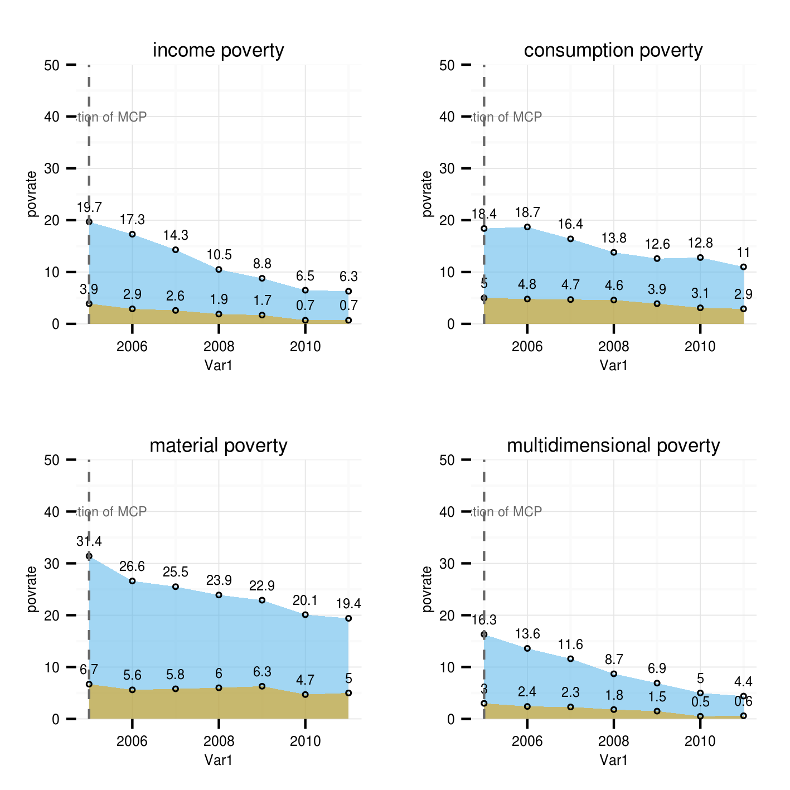

- [Load as vector .pdf](figure/coverageplot.pdf)
- [Load as bitmap .png](figure/coverageplot.png)

### Time plots of individual and joint category

```{rcoverageplot2}

# population
d.df <- svydesign(id = ~id, weights = ~weight, data = df.z)
all <- data.frame(prop.table(svytable(~year + recipient,d.df),1)*100)
all <- subset(all, recipient == 'covered')
all$type <- "population"
all$recipient <- NULL
all <- rename(all, c("Freq" = "coverage"))

# income poor
r <- data.frame(svytable(~year + rt.poor + recipient,d.df))
rl <- dcast(r, year ~ rt.poor + recipient, value.var="Freq")
rl$sum <- rl$non.poor_covered+rl$non.poor_not.covered+rl$poor_covered+rl$poor_not.covered
rl$povrate <- (rl$poor_covered + rl$poor_not.covered)/rl$sum * 100
rl$cov_poor <- rl$poor_covered / rl$sum * 100
rl$coverage <- rl$poor_covered / (rl$poor_covered + rl$poor_not.covered) * 100
rl$leakage <- rl$non.poor_covered / (rl$non.poor_covered + rl$non.poor_not.covered) * 100
rl$non.povrate <- (rl$non.poor_covered + rl$non.poor_not.covered)/rl$sum * 100
inc <- rl[,c(1,9)]
inc$type <- "income.poor"
# consumption poor
r <- data.frame(svytable(~year + cpoor + recipient,d.df))
rl <- dcast(r, year ~ cpoor + recipient, value.var="Freq")
rl$sum <- rl$non.poor_covered+rl$non.poor_not.covered+rl$poor_covered+rl$poor_not.covered
rl$povrate <- (rl$poor_covered + rl$poor_not.covered)/rl$sum * 100
rl$cov_poor <- rl$poor_covered / rl$sum * 100
rl$coverage <- rl$poor_covered / (rl$poor_covered + rl$poor_not.covered) * 100
rl$leakage <- rl$non.poor_covered / (rl$non.poor_covered + rl$non.poor_not.covered) * 100
rl$non.povrate <- (rl$non.poor_covered + rl$non.poor_not.covered)/rl$sum * 100
con <- rl[,c(1,9)]
con$type <- "consumption.poor"
# material poor
r <- data.frame(svytable(~year + md.poor + recipient,d.df))
rl <- dcast(r, year ~ md.poor + recipient, value.var="Freq")
rl$sum <- rl$non.poor_covered+rl$non.poor_not.covered+rl$poor_covered+rl$poor_not.covered
rl$povrate <- (rl$poor_covered + rl$poor_not.covered)/rl$sum * 100
rl$cov_poor <- rl$poor_covered / rl$sum * 100
rl$coverage <- rl$poor_covered / (rl$poor_covered + rl$poor_not.covered) * 100
rl$leakage <- rl$non.poor_covered / (rl$non.poor_covered + rl$non.poor_not.covered) * 100
rl$non.povrate <- (rl$non.poor_covered + rl$non.poor_not.covered)/rl$sum * 100
mat <- rl[,c(1,9)]
mat$type <- "material.poor"
# true poor
r <- data.frame(svytable(~year + true.poor + recipient,d.df))
rl <- dcast(r, year ~ true.poor + recipient, value.var="Freq")
rl$sum <- rl$non.poor_covered+rl$non.poor_not.covered+rl$poor_covered+rl$poor_not.covered
rl$povrate <- (rl$poor_covered + rl$poor_not.covered)/rl$sum * 100
rl$cov_poor <- rl$poor_covered / rl$sum * 100
rl$coverage <- rl$poor_covered / (rl$poor_covered + rl$poor_not.covered) * 100
rl$leakage <- rl$non.poor_covered / (rl$non.poor_covered + rl$non.poor_not.covered) * 100
rl$non.povrate <- (rl$non.poor_covered + rl$non.poor_not.covered)/rl$sum * 100
true <- rl[,c(1,9)]
true$type <- "multidim.poor"

df.coverage <- rbind(all,inc,mat,con,true)
df.coverage$coverage <- round(df.coverage$coverage, 1)

df.coverage$year <- as.numeric(levels(df.coverage$year))[df.coverage$year]

cnames <- subset(df.coverage, year == 2005)
coverageplot2 <- ggplot(df.coverage, aes(x=year, y=coverage, color=type, label=coverage, group=type)) +
  geom_point(shape=1, size=2) + geom_line() +
  geom_text(size=2, vjust=-1) +
  geom_text(data=cnames, aes(x=year, y=coverage, color=type, group=type, label=type), size=2, hjust=-0.2, vjust=3) +
  theme_minimal() +
  theme(axis.title.y = element_text(size=6)) +
  theme(axis.title.x = element_text(size=6)) +
  theme(axis.text.y = element_text(size=6)) +
  theme(axis.text.x = element_text(size=6)) +
  scale_color_manual(values=c("#999999", "#E69F00", "#56B4E9", "#009E73","#D55E00", "#CC79A7","#0072B2","#F0E442")) +
  theme(legend.position="none") +
  theme(legend.title=element_blank()) +
  theme(legend.text=element_text(size=6)) +
  guides(color = guide_legend(nrow = 2)) +
  theme(legend.key.size = unit(3, "mm")) +
  geom_vline(aes(xintercept=2005), colour="Dim Grey", linetype="dashed") +
  annotate("text", x = 2005, y = 30, label = "introduction of MCP", size=2, color="Dim Grey")

pdf("figure/coverageplot2.pdf", width=8/2.54, height=10/2.54)
coverageplot2
dev.off()

ppi <- 300
png("figure/coverageplot2.png", width=8/2.54*ppi, height=10/2.54*ppi, res=ppi)
coverageplot2
dev.off()

```

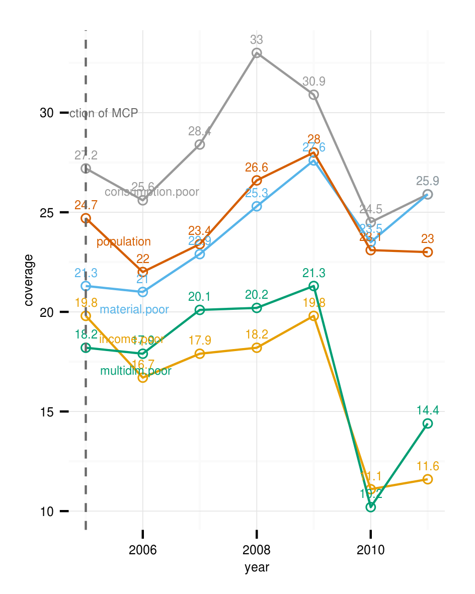

- [Load as vector .pdf](figure/coverageplot2.pdf)
- [Load as bitmap .png](figure/coverageplot2.png)

## Gross-Hoddinott measures

```{rcghplot}
df.z$benefit <- df.z$f12.1ab
x <- subset(df.z, benefit < 9999999)
x <- subset(x, round > 13)
x$year <- factor(x$year)
cdata <- ddply(x, .(year), summarise, 
               N    = length(benefit),
               mean = mean(benefit),
               median = median(benefit),
               sd   = sd(benefit),
               se   = sd(benefit) / sqrt(length(benefit)) )

save(cdata, file="~/workspace/russia/rlms/monetisation/data/mcp.RData")

## income poverty
df.z <- subset(df.z, round > 13)
df.z$benefit[is.na(df.z$benefit)] <- 0
#df.z$benefit[df.z$round < 14] <- 0
df.temp <- df.z[!is.na(df.z$rt.poor), ]
d.df <- svydesign(id = ~id, weights = ~weight, data = df.temp)

# 1) find the total benefit sum

bnf.ratio <- data.frame(svyby(~benefit, ~year+rt.poor, d.df, svytotal)) # benefit-ratio
bnf.ratio$se <- NULL
bnf.ratio.w <- dcast(bnf.ratio, year ~ rt.poor, value.var="benefit") # to wide
bnf.ratio.w$bnf.ratio <- bnf.ratio.w$poor/bnf.ratio.w$non.poor

pop.ratio <- svyby(~rt.poor, ~year, d.df, svytotal) # population-ratio
names(pop.ratio) <- c("year","nonpoor","poor","senonpoor","sepoor")
pop.ratio <- subset(pop.ratio, select=c("year","nonpoor","poor"))
pop.ratio$pop.ratio <- pop.ratio$poor / pop.ratio$nonpoor
#
bnf.ratio.w <- subset(bnf.ratio.w, select=c("year","bnf.ratio"))
pop.ratio <- subset(pop.ratio, select=c("year","pop.ratio"))

cgh <- join(bnf.ratio.w,pop.ratio,by="year")
cgh$cgh <-  round(cgh$bnf.ratio/cgh$pop.ratio, 1)
income.cgh <- cgh
income.cgh$type <- "income.poor"

## ------------------------------------------------------- ##

## material poverty
# 1) find the total benefit sum
df.temp <- df.z[!is.na(df.z$md.poor), ]
d.df <- svydesign(id = ~id, weights = ~weight, data = df.temp)

bnf.ratio <- data.frame(svyby(~benefit, ~year+md.poor, d.df, svytotal)) # benefit-ratio
bnf.ratio$se <- NULL
bnf.ratio.w <- dcast(bnf.ratio, year ~ md.poor, value.var="benefit") # to wide
bnf.ratio.w$bnf.ratio <- bnf.ratio.w$poor/bnf.ratio.w$non.poor

# 2) find the total n of both groups
pop.ratio <- svyby(~md.poor, ~year, d.df, svytotal, na.rm.all=TRUE) # population-ratio
names(pop.ratio) <- c("year","nonpoor","poor","senonpoor","sepoor")
pop.ratio <- subset(pop.ratio, select=c("year","nonpoor","poor"))
pop.ratio$pop.ratio <- pop.ratio$poor / pop.ratio$nonpoor
#
bnf.ratio.w <- subset(bnf.ratio.w, select=c("year","bnf.ratio"))
pop.ratio <- subset(pop.ratio, select=c("year","pop.ratio"))

cgh <- join(bnf.ratio.w,pop.ratio,by="year")
cgh$cgh <-  round(cgh$bnf.ratio/cgh$pop.ratio, 1)
material.cgh <- cgh
material.cgh$type <- "material.poor"

## -------------------------------------------------- ##

## consumption poverty
df.temp <- df.z[!is.na(df.z$cpoor), ]
d.df <- svydesign(id = ~id, weights = ~weight, data = df.temp)

# 1) find the total benefit sum
bnf.ratio <- data.frame(svyby(~benefit, ~year+cpoor, d.df, svytotal)) # benefit-ratio
bnf.ratio$se <- NULL
bnf.ratio.w <- dcast(bnf.ratio, year ~ cpoor, value.var="benefit") # to wide
bnf.ratio.w$bnf.ratio <- bnf.ratio.w$poor/bnf.ratio.w$non.poor

# 2) find the total n of both groups
pop.ratio <- svyby(~cpoor, ~year, d.df, svytotal) # population-ratio
names(pop.ratio) <- c("year","nonpoor","poor","senonpoor","sepoor")
pop.ratio <- subset(pop.ratio, select=c("year","nonpoor","poor"))
pop.ratio$pop.ratio <- pop.ratio$poor / pop.ratio$nonpoor
#
bnf.ratio.w <- subset(bnf.ratio.w, select=c("year","bnf.ratio"))
pop.ratio <- subset(pop.ratio, select=c("year","pop.ratio"))

cgh <- join(bnf.ratio.w,pop.ratio,by="year")
cgh$cgh <-  round(cgh$bnf.ratio/cgh$pop.ratio, 1)
consumption.cgh <- cgh
consumption.cgh$type <- "consumption"

## multi poverty (true poor)

df.temp <- df.z[!is.na(df.z$true.poor), ]
d.df <- svydesign(id = ~id, weights = ~weight, data = df.temp)

# 1) find the total benefit sum
bnf.ratio <- data.frame(svyby(~benefit, ~year+true.poor, d.df, svytotal)) # benefit-ratio

bnf.ratio$se <- NULL
bnf.ratio.w <- dcast(bnf.ratio, year ~ true.poor, value.var="benefit") # to wide
bnf.ratio.w$bnf.ratio <- bnf.ratio.w$poor/bnf.ratio.w$non.poor

# 2) find the total n of both groups
pop.ratio <- svyby(~true.poor, ~year, d.df, svytotal) # population-ratio
names(pop.ratio) <- c("year","nonpoor","poor","senonpoor","sepoor")
pop.ratio <- subset(pop.ratio, select=c("year","nonpoor","poor"))
pop.ratio$pop.ratio <- pop.ratio$poor / pop.ratio$nonpoor
#
bnf.ratio.w <- subset(bnf.ratio.w, select=c("year","bnf.ratio"))
pop.ratio <- subset(pop.ratio, select=c("year","pop.ratio"))

cgh <- join(bnf.ratio.w,pop.ratio,by="year")
cgh$cgh <-  round(cgh$bnf.ratio/cgh$pop.ratio, 1)
true.cgh <- cgh
true.cgh$type <- "poor_in_2or3_dimensions"

df.cgh <- rbind(income.cgh,material.cgh,consumption.cgh,true.cgh)

cnames <- subset(df.cgh, year==2011)
cghplot <- ggplot(df.cgh, aes(x=year, y=cgh, color=type, group=type, label=cgh)) +
  geom_point(shape=1, size=2) + geom_line() +
  geom_text(size=2, vjust=-1) +
  geom_text(data=cnames, aes(x=year, y=cgh, color=type, 
                             group=type, label=type), 
            size=2, hjust=1, vjust=-1) +
  theme_minimal() +
  theme(axis.title.y = element_text(size=6)) +
  theme(axis.title.x = element_text(size=6)) +
  theme(axis.text.y = element_text(size=6)) +
  theme(axis.text.x = element_text(size=6)) +
  scale_color_manual(values=c("#999999", "#E69F00", "#56B4E9", "#009E73","#D55E00", "#CC79A7","#0072B2","#F0E442")) +
  theme(legend.position="none") +
  theme(legend.title=element_blank()) +
  theme(legend.text=element_text(size=6)) +
  guides(color = guide_legend(nrow = 2)) +
  theme(legend.key.size = unit(3, "mm")) +
  geom_hline(aes(yintercept=1), colour="Dim Grey", linetype="dashed") +
  scale_x_continuous(breaks = 2000:2011)


pdf("figure/cghplot.pdf", width=12/2.54, height=8/2.54)
cghplot
dev.off()

ppi <- 300
png("figure/cghplot.png", width=12/2.54*ppi, height=8/2.54*ppi, res=ppi)
cghplot
dev.off()

# rm(list=setdiff(ls(), "df.z"))
```

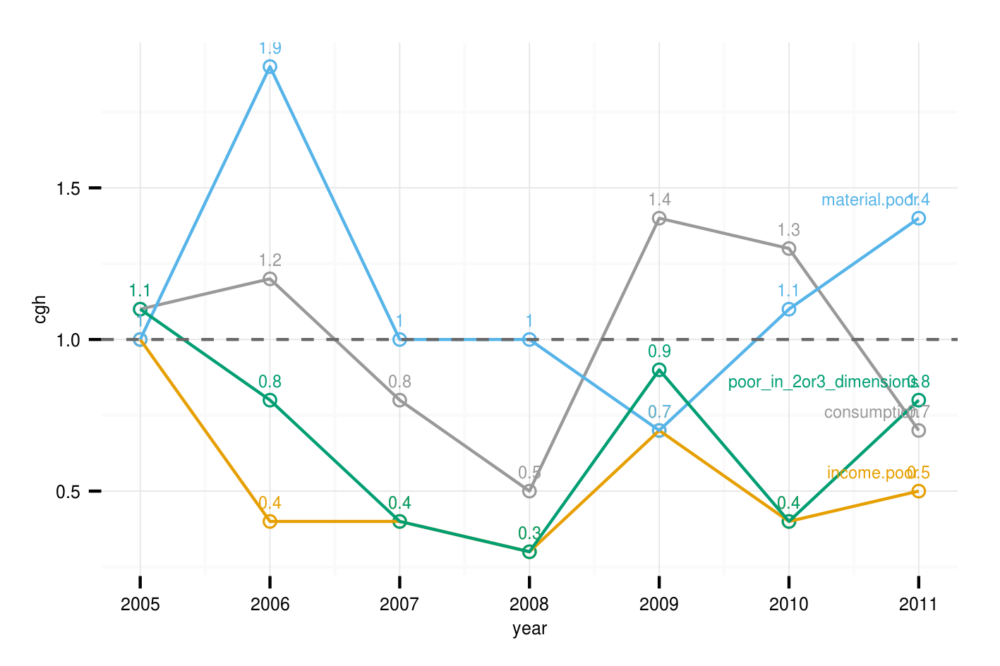

- [Load as vector .pdf](figure/cghplot.pdf)
- [Load as bitmap .png](figure/cghplot.png)

# Multidimensional poverty and GCH-measure on map

```{r, eval=FALSE}
library(mapproj)
library(maptools)
library(rgdal)
library(ggplot2)
library(gdata)
library(survey)

map <- readOGR(dsn ="/home/aurelius/workspace/data/shapefiles/russia/gadm/RUS_adm_simple", layer="RUS_adm2")
map@data$id <- rownames(map@data)
map.points <- fortify(map, region = "id")
map.df <- merge(map.points, map@data, by = "id")

library(RCurl)
GHurl <- getURL("https://raw.github.com/muuankarski/data/master/russia/rus_rlms.csv")
region <- read.csv(text = GHurl)

## data
# income pooe
df.2011 <- subset(df.z, year == 2011)
d.df <- svydesign(id = ~id, weights = ~weight, data = df.2011)
t2 <- data.frame(prop.table(svytable(~rt.poor + psu, d.df), 2) * 100)
t3.i <- subset(t2, rt.poor %in% "poor")
t3.i$Freq <- round(t3.i$Freq, 1)
t3.i$group1 <- "income.poverty.rate"
t3.i$rt.poor <- NULL
# consumption poor
t2 <- data.frame(prop.table(svytable(~cpoor + psu, d.df), 2) * 100)
t3.c <- subset(t2, cpoor %in% "poor")
t3.c$Freq <- round(t3.c$Freq, 1)
t3.c$group1 <- "consumption.poverty.rate"
t3.c$cpoor <- NULL
# material poor
t2 <- data.frame(prop.table(svytable(~md.poor + psu, d.df), 2) * 100)
t3.m <- subset(t2, md.poor %in% "poor")
t3.m$Freq <- round(t3.m$Freq, 1)
t3.m$group1 <- "material.poverty.rate"
t3.m$md.poor <- NULL
df <- rbind(t3.i,t3.c,t3.m)

df$Freq <- round(df$Freq, 1)

region_ID_1 <- subset(region, ID_1 != 0)
region_ID_2 <- subset(region, ID_2 != 0)
df_ID_1 <- merge(df,region_ID_1,by="psu")
df_ID_2 <- merge(df,region_ID_2,by="psu")
choro_ID_1 <- merge(map.df,df_ID_1, by="ID_1", type = "full")
choro_ID_1 <- rename(choro_ID_1, c("ID_2.x" = "ID_2"))
choro_ID_1$ID_2.y <- NULL 
choro_ID_2 <- merge(map.df,df_ID_2, by="ID_2", type = "right")
choro_ID_2 <- rename(choro_ID_2, c("ID_1.x" = "ID_1"))
choro_ID_2$ID_1.y <- NULL 
choro <- rbind(choro_ID_1,choro_ID_2)
choro1 <- choro[order(choro$order),]


choro <- subset(choro1, group1 == 'income.poverty.rate')

cnames <- stats:::aggregate.formula(cbind(long, lat, Freq) ~ psu_txt, 
                                    data=choro, mean)
cnames$Freq <- round(cnames$Freq,0)

mapplot1 <- ggplot(choro, aes(long,lat,group=group)) +
  geom_polygon(data = map.df, aes(long,lat), fill=NA, 
               color = "Gray 70", size=0.2) +
  geom_text(data=cnames, aes(long, lat, label = psu_txt, group=psu_txt), 
            size=1.5, color="black", vjust=-2) +
  geom_point(data=cnames, aes(long, lat, size = Freq, group=psu_txt), 
             shape=1, color="Gray 50") +
  geom_text(data=cnames, aes(long, lat, label = Freq, group=psu_txt), 
            size=1.5, color="black") +
  theme_minimal() +
  theme(axis.title.y = element_text(size=6)) +
  theme(axis.title.x = element_text(size=6)) +
  theme(axis.text.y = element_text(size=6)) +
  theme(axis.text.x = element_text(size=6)) +
  theme(legend.title=element_blank()) +
  theme(legend.text=element_text(size=6)) +
  theme(legend.position="top") +
  theme(title = element_text(size=7)) +
  coord_map(project="orthographic", xlim=c(35,145),
            ylim=c(45,70))

choro <- subset(choro1, group1 == 'consumption.poverty.rate')

cnames <- stats:::aggregate.formula(cbind(long, lat, Freq) ~ psu_txt, 
                                    data=choro, mean)
cnames$Freq <- round(cnames$Freq,0)

mapplot2 <- ggplot(choro, aes(long,lat,group=group)) +
  geom_polygon(data = map.df, aes(long,lat), fill=NA, 
               color = "Gray 70", size=0.2) +
  geom_text(data=cnames, aes(long, lat, label = psu_txt, group=psu_txt), 
            size=1.5, color="black", vjust=-2) +
  geom_point(data=cnames, aes(long, lat, size = Freq, group=psu_txt), 
             shape=1, color="Gray 50") +
  geom_text(data=cnames, aes(long, lat, label = Freq, group=psu_txt), 
            size=1.5, color="black") +
  theme_minimal() +
  theme(axis.title.y = element_text(size=6)) +
  theme(axis.title.x = element_text(size=6)) +
  theme(axis.text.y = element_text(size=6)) +
  theme(axis.text.x = element_text(size=6)) +
  theme(legend.title=element_blank()) +
  theme(legend.text=element_text(size=6)) +
  theme(legend.position="top") +
  theme(title = element_text(size=7)) +
  coord_map(project="orthographic", xlim=c(35,145),
            ylim=c(45,70))

choro <- subset(choro1, group1 == 'material.poverty.rate')

cnames <- stats:::aggregate.formula(cbind(long, lat, Freq) ~ psu_txt, 
                                    data=choro, mean)
cnames$Freq <- round(cnames$Freq,0)

mapplot3 <- ggplot(choro, aes(long,lat,group=group)) +
  geom_polygon(data = map.df, aes(long,lat), fill=NA, 
               color = "Gray 70", size=0.2) +
  geom_text(data=cnames, aes(long, lat, label = psu_txt, group=psu_txt), 
            size=1.5, color="black", vjust=-2) +
  geom_point(data=cnames, aes(long, lat, size = Freq, group=psu_txt), 
             shape=1, color="Gray 50") +
  geom_text(data=cnames, aes(long, lat, label = Freq, group=psu_txt), 
            size=1.5, color="black") +
  theme_minimal() +
  theme(axis.title.y = element_text(size=6)) +
  theme(axis.title.x = element_text(size=6)) +
  theme(axis.text.y = element_text(size=6)) +
  theme(axis.text.x = element_text(size=6)) +
  theme(legend.title=element_blank()) +
  theme(legend.text=element_text(size=6)) +
  theme(legend.position="top") +
  theme(title = element_text(size=7)) +
  coord_map(project="orthographic", xlim=c(35,145),
            ylim=c(45,70))


pdf("figure/mapplot1.pdf", width=14/2.54, height=9/2.54)
mapplot1
dev.off()

pdf("figure/mapplot2.pdf", width=14/2.54, height=9/2.54)
mapplot2
dev.off()

pdf("figure/mapplot3.pdf", width=14/2.54, height=9/2.54)
mapplot3
dev.off()

ppi <- 300
png("figure/mapplot1.png", width=14/2.54*ppi, height=9/2.54*ppi, res=ppi)
mapplot1
dev.off()

png("figure/mapplot2.png", width=14/2.54*ppi, height=9/2.54*ppi, res=ppi)
mapplot2
dev.off()

png("figure/mapplot3.png", width=14/2.54*ppi, height=9/2.54*ppi, res=ppi)
mapplot3
dev.off()

```

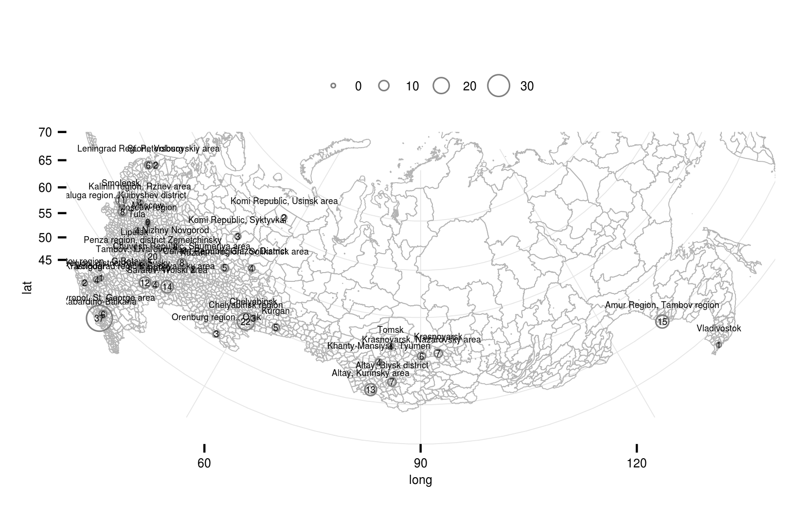

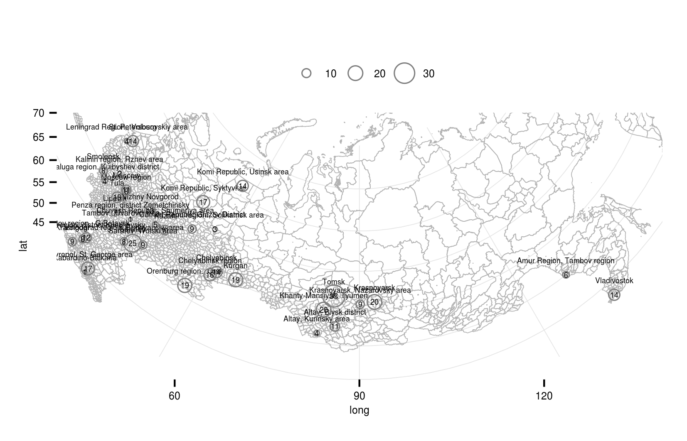

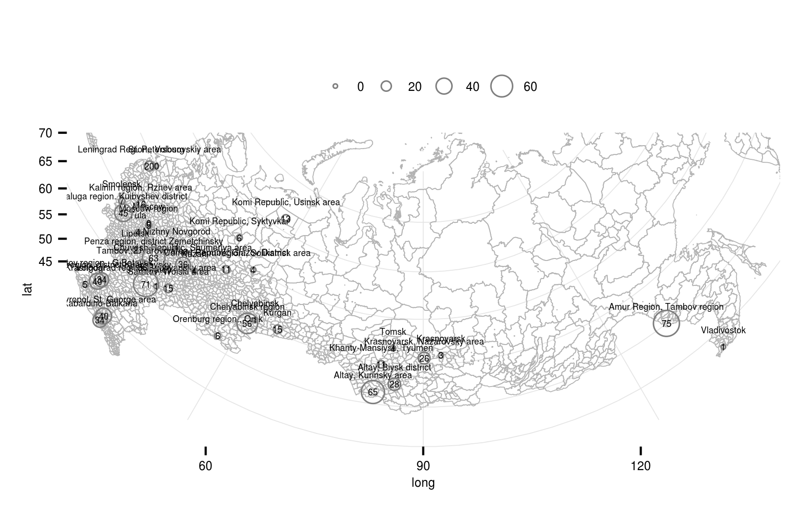


```{rmapcov_meanbenefit,eval=FALSE}
library(mapproj)
library(maptools)
library(rgdal)
library(ggplot2)
library(gdata)
library(survey)

map <- readOGR(dsn ="/home/aurelius/workspace/data/shapefiles/russia/gadm/RUS_adm_simple", layer="RUS_adm2")
map@data$id <- rownames(map@data)
map.points <- fortify(map, region = "id")
map.df <- merge(map.points, map@data, by = "id")

library(RCurl)
GHurl <- getURL("https://raw.github.com/muuankarski/data/master/russia/rus_rlms.csv")
region <- read.csv(text = GHurl)

## data
# coverage
df.2010 <- subset(df.z, year == 2010)
d.df <- svydesign(id = ~id, weights = ~weight, data = df.2010)
t2 <- data.frame(prop.table(svytable(~recipient + psu, d.df), 2) * 100)
t3.cov <- subset(t2, recipient %in% "covered")
t3.cov$Freq <- round(t3.cov$Freq, 1)
t3.cov$group1 <- "coverage.rate"
t3.cov$recipient <- NULL
df <- t3.cov

region_ID_1 <- subset(region, ID_1 != 0)
region_ID_2 <- subset(region, ID_2 != 0)
df_ID_1 <- merge(df,region_ID_1,by="psu")
df_ID_2 <- merge(df,region_ID_2,by="psu")
choro_ID_1 <- merge(map.df,df_ID_1, by="ID_1", type = "full")
choro_ID_1 <- rename(choro_ID_1, c("ID_2.x" = "ID_2"))
choro_ID_1$ID_2.y <- NULL 
choro_ID_2 <- merge(map.df,df_ID_2, by="ID_2", type = "right")
choro_ID_2 <- rename(choro_ID_2, c("ID_1.x" = "ID_1"))
choro_ID_2$ID_1.y <- NULL 
choro <- rbind(choro_ID_1,choro_ID_2)
choro <- choro[order(choro$order),]

cnames <- stats:::aggregate.formula(cbind(long, lat, Freq) ~ psu_txt, 
                                    data=choro, mean)
cnames$Freq <- round(cnames$Freq,0)

mapplotcov <- ggplot(choro, aes(long,lat,group=group)) +
  geom_polygon(data = map.df, aes(long,lat), fill=NA, 
               color = "Gray 90", size=0.2) +
  geom_text(data=cnames, aes(long, lat, label = psu_txt, group=psu_txt), 
            size=1.5, color="black", vjust=-2) +
  geom_point(data=cnames, aes(long, lat, size = Freq, group=psu_txt), 
             shape=1, color="Gray 70") +
  geom_text(data=cnames, aes(long, lat, label = Freq, group=psu_txt), 
            size=1.5, color="black") +
  theme_minimal() +
  theme(axis.title.y = element_text(size=6)) +
  theme(axis.title.x = element_text(size=6)) +
  theme(axis.text.y = element_text(size=6)) +
  theme(axis.text.x = element_text(size=6)) +
  theme(legend.title=element_blank()) +
  theme(legend.text=element_text(size=6)) +
  theme(legend.position="top") +
  theme(title = element_text(size=7)) +
  coord_map(project="orthographic", xlim=c(35,145),
            ylim=c(45,70))

pdf("figure/mapplotcov.pdf", width=14/2.54, height=9/2.54)
mapplotcov
dev.off()

png("figure/mapplotcov.png",  width=14/2.54*ppi, height=9/2.54*ppi, res=ppi)
mapplotcov
dev.off()


# mean benefit
x <- subset(df.z, benefit < 9999999)
df.2010 <- subset(x, year == 2010)
d.df <- svydesign(id = ~id, weights = ~weight, data = df.2010)


t2 <- data.frame(svyby(~benefit, ~psu, d.df, svymean))
names(t2) <- c("psu","Freq","se")
t3.ben <- t2
t3.ben$Freq <- round(t3.ben$Freq, 1)
t3.ben$group1 <- "mean.benefit"
t3.ben$se <- NULL
df <- t3.ben

region_ID_1 <- subset(region, ID_1 != 0)
region_ID_2 <- subset(region, ID_2 != 0)
df_ID_1 <- merge(df,region_ID_1,by="psu")
df_ID_2 <- merge(df,region_ID_2,by="psu")
choro_ID_1 <- merge(map.df,df_ID_1, by="ID_1", type = "full")
choro_ID_1 <- rename(choro_ID_1, c("ID_2.x" = "ID_2"))
choro_ID_1$ID_2.y <- NULL 
choro_ID_2 <- merge(map.df,df_ID_2, by="ID_2", type = "right")
choro_ID_2 <- rename(choro_ID_2, c("ID_1.x" = "ID_1"))
choro_ID_2$ID_1.y <- NULL 
choro <- rbind(choro_ID_1,choro_ID_2)
choro <- choro[order(choro$order),]

cnames <- stats:::aggregate.formula(cbind(long, lat, Freq) ~ psu_txt, 
                                    data=choro, mean)
cnames$Freq <- round(cnames$Freq,0)

mapplotben <- ggplot(choro, aes(long,lat,group=group)) +
  geom_polygon(data = map.df, aes(long,lat), fill=NA, 
               color = "Gray 90", size=0.2) +
  geom_text(data=cnames, aes(long, lat, label = psu_txt, group=psu_txt), 
            size=1.5, color="black", vjust=-2) +
  geom_point(data=cnames, aes(long, lat, size = Freq, group=psu_txt), 
             shape=1, color="Gray 70") +
  geom_text(data=cnames, aes(long, lat, label = Freq, group=psu_txt), 
            size=1.5, color="black") +
  theme_minimal() +
  theme(axis.title.y = element_text(size=6)) +
  theme(axis.title.x = element_text(size=6)) +
  theme(axis.text.y = element_text(size=6)) +
  theme(axis.text.x = element_text(size=6)) +
  theme(legend.title=element_blank()) +
  theme(legend.text=element_text(size=6)) +
  theme(legend.position="top") +
  theme(title = element_text(size=7)) +
  coord_map(project="orthographic", xlim=c(35,145),
            ylim=c(45,70))

pdf("figure/mapplotben.pdf", width=14/2.54, height=9/2.54)
mapplotben
dev.off()

png("figure/mapplotben.png",  width=14/2.54*ppi, height=9/2.54*ppi, res=ppi)
mapplotben
dev.off()

```

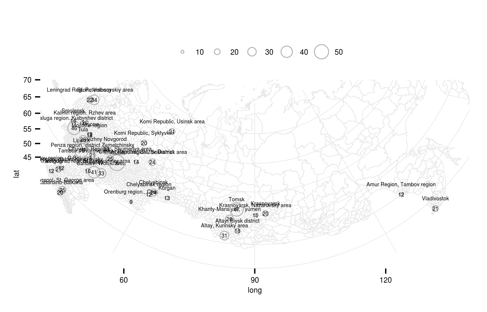

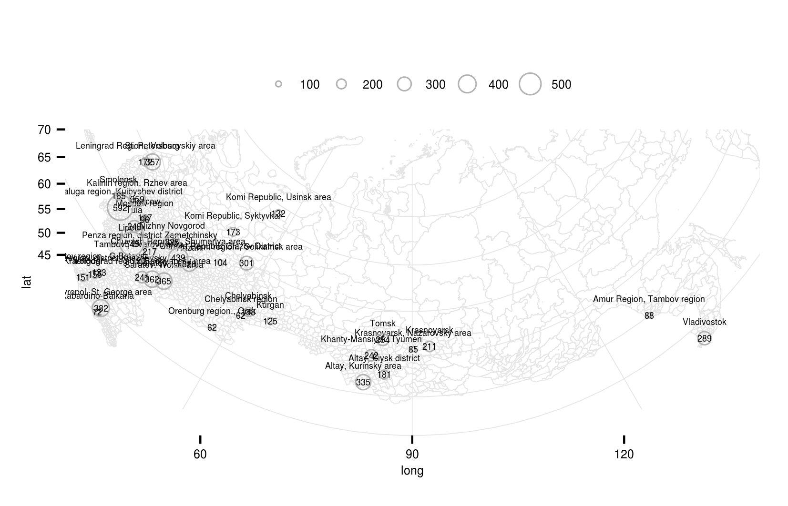


```{rcovbenplot,eval=FALSE}
# coverage
x <- subset(df.z, benefit < 9999999)
df.2011 <- subset(x, year != 2012)
d.df <- svydesign(id = ~id, weights = ~weight, data = df.2011)
t2 <- data.frame(prop.table(svytable(~recipient + psu, d.df), 2) * 100)
t3.cov <- subset(t2, recipient %in% "covered")
t3.cov$Freq <- round(t3.cov$Freq, 1)
names(t3.cov) <- c("recipient","psu","coverage.rate")
t3.cov$recipient <- NULL


r <- data.frame(svytable(~year + psu + recipient,d.df))
rl <- dcast(r, psu + year ~ recipient, value.var="Freq")
rl$coverage.rate <- rl$covered/ (rl$covered + rl$not.covered) *100
t3.cov <- rl[,c(1,2,5)]

t2 <- data.frame(svyby(~benefit, ~psu+year, d.df, svymean))
names(t2) <- c("psu","year","mean.benefit","se")
t3.ben <- t2
t3.ben$mean.benefit <- round(t3.ben$mean.benefit, 1)
t3.ben$se <- NULL
df <- merge(t3.cov,t3.ben)
df <- merge(df,region[,5:6], by="psu")
df <- subset(df, mean.benefit < 1000)

df$year <- as.numeric(levels(df$year))[df$year]
df <- subset(df, year > 2004)

covbenplot <- ggplot(df, aes(x=coverage.rate, y=mean.benefit, label=psu_txt)) +
  geom_point(size=1,alpha=.7) + facet_wrap(~year, scales="free") +
  geom_smooth(method=lm) +
  geom_text(size=1.5,vjust=1,color="Grey 60") +
  theme_minimal() +
  theme(axis.title.y = element_text(size=6)) +
  theme(axis.title.x = element_text(size=6)) +
  theme(axis.text.y = element_text(size=6)) +
  theme(axis.text.x = element_text(size=6)) +
  theme(legend.title=element_blank()) +
  theme(legend.text=element_text(size=6)) +
  theme(strip.text = element_text(size=6))

pdf("figure/covbenplot.pdf", width=10/2.54, height=14/2.54)
covbenplot
dev.off()

png("figure/covbenplot.png",  width=14/2.54*ppi, height=9/2.54*ppi, res=ppi)
covbenplot
dev.off()

covbenplot_slide <- ggplot(df, aes(x=coverage.rate, 
                                   y=mean.benefit, label=psu_txt)) +
  geom_point(size=1,alpha=.7) + 
  facet_wrap(~year, scales="free", nrow=2) +
  geom_smooth(method=lm) +
  geom_text(size=1.5,vjust=1,color="Grey 60") +
  theme_minimal() +
  theme(axis.title.y = element_text(size=6)) +
  theme(axis.title.x = element_text(size=6)) +
  theme(axis.text.y = element_text(size=6)) +
  theme(axis.text.x = element_text(size=6)) +
  theme(legend.title=element_blank()) +
  theme(legend.text=element_text(size=6)) +
  theme(strip.text = element_text(size=6))

png("figure/covbenplot_slide.png",  width=14/2.54*ppi, height=9/2.54*ppi, res=ppi)
covbenplot_slide
dev.off()

dfy <- subset(df, year == 2011)
covbenplot_slide2 <- ggplot(dfy, aes(x=coverage.rate, 
                                   y=mean.benefit, label=psu_txt)) +
  geom_point(size=1,alpha=.7) + 
  geom_smooth(method=lm) +
  geom_text(size=3,vjust=1,color="Grey 60") +
  theme_minimal() +
  theme(axis.title.y = element_text(size=6)) +
  theme(axis.title.x = element_text(size=6)) +
  theme(axis.text.y = element_text(size=6)) +
  theme(axis.text.x = element_text(size=6)) +
  theme(legend.title=element_blank()) +
  theme(legend.text=element_text(size=6)) +
  theme(strip.text = element_text(size=6))

png("figure/covbenplot_slide2.png",  width=14/2.54*ppi, height=9/2.54*ppi, res=ppi)
covbenplot_slide2
dev.off()

```


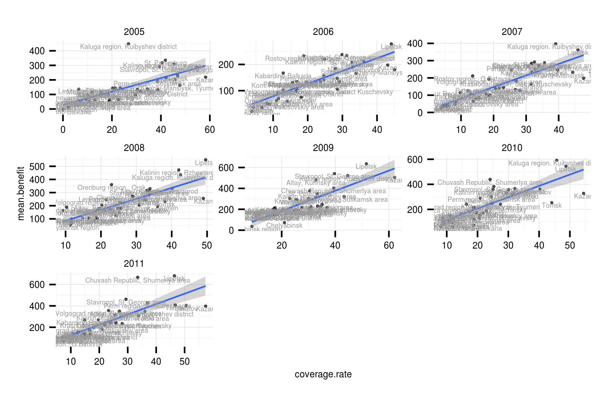


```{rerrortable,eval=FALSE}
#x <- subset(df.z, benefit < 9999999)
#df.2011 <- subset(x, year != 2012)
d.df <- svydesign(id = ~id, weights = ~weight, data = df.z)
error <- data.frame(svytable(~year+multi.poor+recipient, d.df))
error.w <- dcast(error, year ~ multi.poor + recipient, value.var="Freq")
error.w$coveredsum <-  error.w$non.poor_covered + 
                       error.w$all.poor_covered +
                       error.w$consumption_income.poor_covered +
                       error.w$consumption_material.poor_covered +
                       error.w$material_income.poor_covered +
                       error.w$only_consumption.poor_covered +
                       error.w$only_income.poor_covered +
                       error.w$only_material.poor_covered

error.w$error1 <- error.w$non.poor_covered / error.w$coveredsum * 100
df.error1 <- subset(error.w, select=c("year","error1"))

error2 <- data.frame(svytable(~year+multi.poor+recipient, d.df))
error2 <- subset(error2, multi.poor != 'non.poor')
error2.w <- dcast(error2, multi.poor + year ~ recipient, value.var="Freq")

error2.w$coverage.rate <- error2.w$covered / 
                          (error2.w$covered + 
                          error2.w$not.covered) *100

error2.w$error2 <- error2.w$not.covered / 
                  (error2.w$covered + 
                   error2.w$not.covered) *100

error2.w <- merge(error2.w,df.error1,by="year")
error2.w$targ.diff <- error2.w$covered - error2.w$error1
df.error2 <- error2.w[,c(1:2,5,6,8)]
df.error2.l <- melt(df.error2, id.vars=c("multi.poor","year"), 
                    measure.vars=c("coverage.rate","error2","targ.diff"))
df.error2.l$value <- round(df.error2.l$value, 1)

df.error2.w <- dcast(df.error2.l, multi.poor + variable ~ year, 
                     value.var="value")

names(df.error2.w) <- c("Deprivation subgroup","Measure",
                        2005:2011)

save(df.error1, file="~/workspace/russia/rlms/monetisation/data/error1.RData")
save(df.error2.w, file="~/workspace/russia/rlms/monetisation/data/error2.RData")
```


```{rtable1, results='asis', echo=FALSE,eval=FALSE}
library(xtable)
tbl <- xtable(df.error1, caption="Type 1 error (leakage) of MCP (Source: RLMS-HSE)", digits=1)
print.xtable(tbl, type="html", include.rownames=FALSE, comment=FALSE, caption.placement="top")
```

```{rtable2, results='asis', echo=FALSE,eval=FALSE}
tbl <- xtable(df.error2.w, caption="Coverage, type 2 error (targeting error) and targeting differentials of MCP benefits (Source: RLMS-HSE)", digits=1)
print.xtable(tbl, type="html", include.rownames=FALSE, comment=FALSE, caption.placement="top")
```
