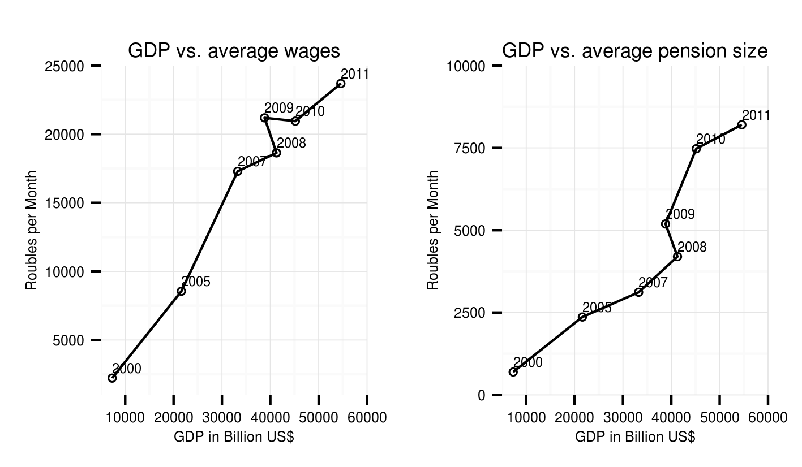
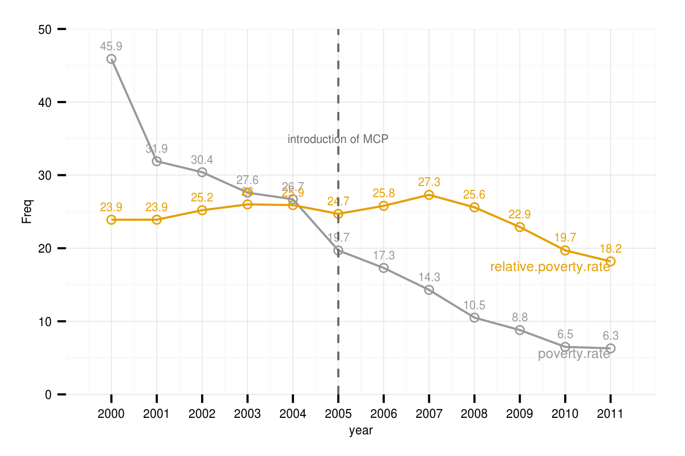
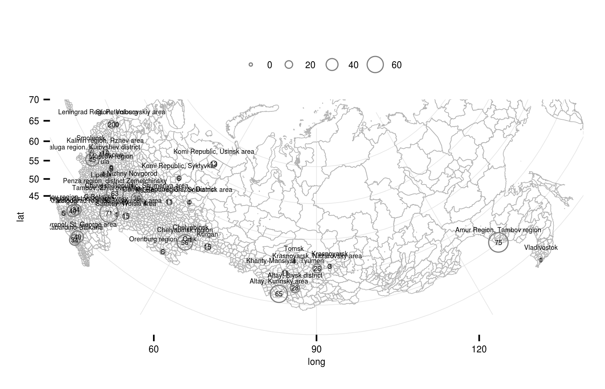
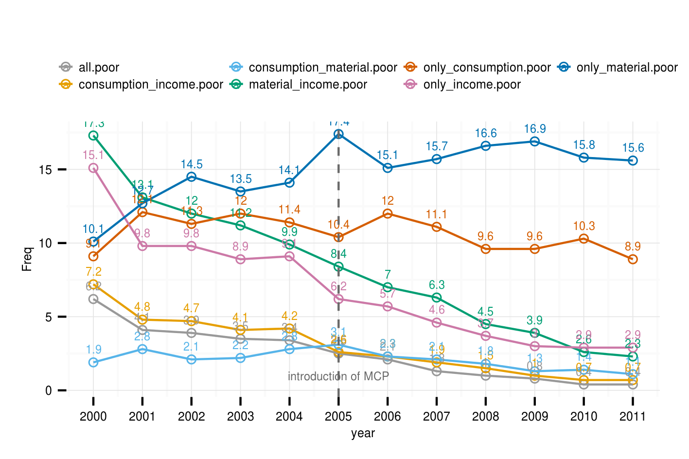
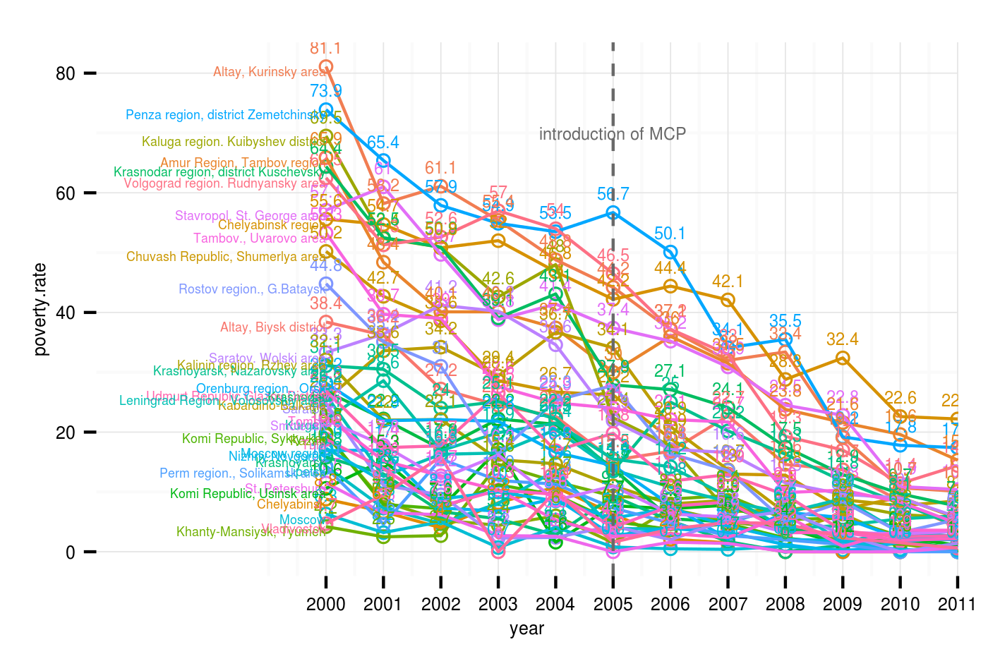
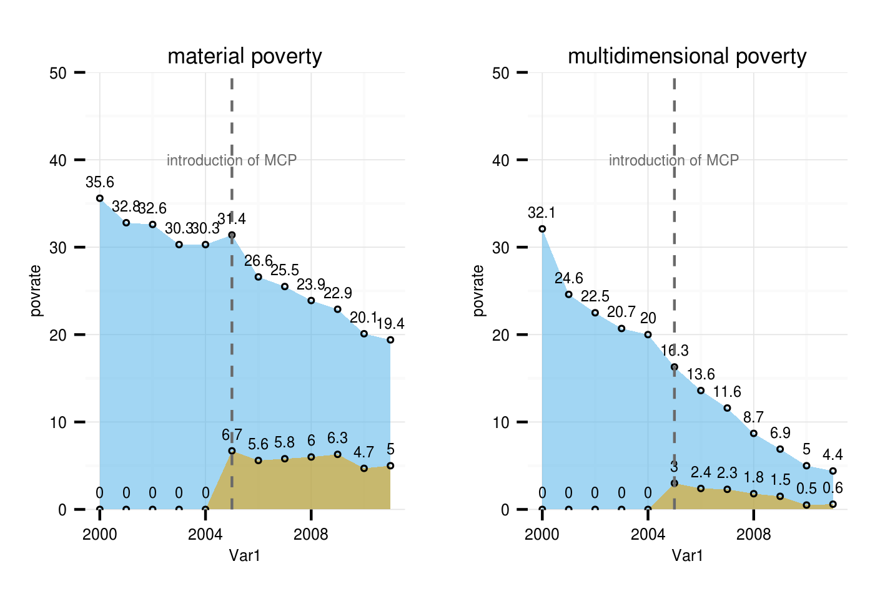

Targeting performance of monthly cash payments at multidimensional poverty in Russia in 2000 - 2011
========================================================
author: 1st RLMS-HSE conference at HSE Moscow in May 18, 2013
transition: fade
css: ../../../template/rpresentation/slides.css

**Markus Kainu**
*PhD student, [Aleksanteri institute, University of Helsinki](http://helsinki.fi/aleksanteri)  *

kuvio
========================================================
title:false

[www.helsinki.fi/aleksanteri/crm/](http://www.helsinki.fi/aleksanteri/crm/)

Content
========================================================

1. What and Why?
2. Data and Methods
4. Results
5. Conclusions

1. What and why?
========================================================
title: false
<h1 style="text-align:center;padding-top:200px;">1. What and why?</h1>

General research question?
========================================================
>To what extend monetisation reform has improved the capacity of Russian welfare state to fulfil its modern tasks of redistribution of income and reduction of poverty?

<!--
What are the effects of introduction of *monthly cash payments* MCP (monetization of l'goty) to the capacity of Russian welfare system to reduce poverty and redistribute income?
-->

Theoretical framing
========================================================
1. Monetization reform of the in-kind benefits in 2005
2. Multidimensional poverty vs. unidimensional income/consumption
3. Targeting performance/poverty reduction capacity of income transfers

kuvio2
========================================================
title:false

kuvio2
========================================================
title:false

1. Monetization reform
========================================================
- Monetization of in-kind benefits has been one of the major reforms in attempt to modernize Russian welfare system
- A complex system of in-kind benefits were monetized into cash transfers "monthly cash payments" (MCP) in 2005
- Benefit forms a major part of non-contributory programs, covers roughly one fourth of Russian households and has therefore potential to improve the redistributive nature of welfare system
- The benefit scheme has been active for several years and there is need to look at its potential in poverty reduction and income redistribution

Rationales behind the reform
========================================================
1. **Financial rationale**: financial burden in the form of unfunded mandates in benefit systems
 <!--This was the case especially with different veteran priviledges that amounted more than ten times of the financial costs of targereted social assistance programs and covered roughly 70 percent of the population. Welfare systems was not able to fulfil these mandates resulting a great share of population unable to access the benefit they were entitled to . -->
2. **Social rationale**: poor targeting of priviledges. High poverty rates and growing inequality had resulted in social rationale for reforming the system.
 <!--Allocation of in-kind benefits was based on categories, but there was no category for poor households/individuals. The social security system as whole was regressive with less than 10 percent of the resources means tested.-->
3. **Economic rationale**: *existence of various kinds of privileges that encompassed virtually half of the country’s population significantly distorted the financial balances of several economic sectors including transportation, housing and utilities.* [p. 13., @sinitsina_experience_2009]

Previous analysis of the reform
========================================================

- Early analysis already claimed that the there is no social rationale in the reform and that it the reform had nothing to do with social policy [@alexandrova_reform_2007]
    - reform preserved the categorical principle in resource allocation it provided no immediate nor blueprint for the future improvements of social policy.  
    - reforms was considered regressive from the regional point of view. 
    - Increase in financial responsibilities of local governments was expected to increase the differentiation of living conditions between families living in rich or poor areas.
- On the whole, the monetization made very limited progress compared to its potential. 
- From comparative perspective the reform was very modest compared to what CIS countries have accomplished.

<!--
Table: Transformation of in-kind benefits by Russian regions in implementing Russian Federal Law 122
          
                          Labour veterans Home-front workers Victims of political repressions
------------------------- --------------- ------------------ ----------
In-kind privileges remain 10              17                 9
Partial monetization      65              34                 67
Full                      4               28                 3
 
*Source: Institute of Urban Economics survey of regional social assistance offices [as in @alexandrova_reform_2007]*
-->

2. Multidimensional poverty
========================================================
- More recently there has been a growing interest in what have come to be termed *multidimensional indices of poverty* [@ravallion_multidimensional_2011] partly provoked by the introduction *multidimensional poverty index* by Oxford Poverty & Human Development Initiative [@alkire_counting_2010]. 
- In the context of Russian Federation the problems of income based poverty assessments are clear. 
- On one hand, the incomes reported by households may not be accurate and on other the especially the worst off households rely on survival strategies beyond the money economy, eg. barter and subsistence agriculture. 
- Therefore a this paper utilizes a multidimensional measure of poverty including items of deprivation in income, in consumption and in material well-being.

3. Poverty reduction capacity of income transfers
========================================================
- The interplay between welfare state policies and poverty reduction has received attention in comparative studies in over the years [@mitchell_income_1991;@korpi_paradox_1998;@kenworthy_social-welfare_1999;@kenworthy_progress_2011]. 
- Main focus has been at the *distributional outcomes* of welfare state policies. 
- Several studies have also emphasized the social assistance schemes linking the schemes with the *poverty outcomes* [@nelson_minimum_2009;@behrendt_at_2002;@kuivalainen_comparative_2004]. 
- The attempts to connect welfare state benefits with other forms of poverty than income poverty have been very few, with the exception a recent study by [@nelson_counteracting_2012] on link between social assistance benefit levels and material deprivation in the European Union. <!--Nelson finds a link between low levels of social assistance and high rates of material deprivation when studying 26 EU countries.-->

Research questions
========================================================
incremental:true
1. Multidimensional poverty: What are the trends and regional variation?
2. What is the coverage and targeting performance of MCP benefits at households with multiple deprivations?
3. How has the impact changed over time?

2. Data & Methods
========================================================
title: false
<h1 style="text-align:center;padding-top:200px;">2. Data & Methods</h1>

2.1 Rounds and files
========================================================

### RLMS-HSE data
- 11 rounds from 9 (2000) to 20 (2011)
- cross-sectional setting at **household level**
- full sample (*Полная выборка*) from HSE website

2.2 Variables and identification of poor households
========================================================

a) Income poor households
========================================================

Variables/threshold
========================================================

<!-- html table generated in R 3.0.2 by xtable 1.7-1 package -->
<!-- Tue Dec  3 18:31:28 2013 -->
<TABLE border=1>
<TR> <TH> item </TH> <TH> variable </TH>  </TR>
  <TR> <TD> disposable income </TD> <TD> f14 </TD> </TR>
   </TABLE>

- [Rosstat subsistence minimum threshold for total population](http://www.gks.ru/bgd/regl/b12_12/IssWWW.exe/stg/d01/07-11.htm) from Rosstat used as poverty line
- Household income **equivalized** using **square root** of household size
- Households with equivalized income below the subsistence minimum for total population are qualified as poor

[See for more details](analysis/desc_income_compare.html#income-distribution)

Income poverty in 2000 - 2011 (Source: RLMS-HSE)
========================================================

========================================================

b) Materially deprived households
========================================================

Variables/threshold
========================================================

<!-- html table generated in R 3.0.2 by xtable 1.7-1 package -->
<!-- Tue Dec  3 18:31:28 2013 -->
<TABLE border=1>
<TR> <TH> item </TH> <TH> variable </TH>  </TR>
  <TR> <TD> television </TD> <TD> c9.5.1a/c9.5.1b </TD> </TR>
  <TR> <TD> tap water </TD> <TD> c7.2 </TD> </TR>
  <TR> <TD> hot water </TD> <TD> c7.3 </TD> </TR>
  <TR> <TD> sewage </TD> <TD> c7.5 </TD> </TR>
  <TR> <TD> computer </TD> <TD> c9.621a/c9.622a </TD> </TR>
   </TABLE>

Household is categorized as **consumption poor** if they unvoluntarily lack **three or more** of these items

[See for more details](analysis/desc_material_compare.html#items-of-material-deprivation)

Material deprivation in 2000 - 2011. Individual items in colors and joint indicator in black. (Source: RLMS-HSE
========================================================

Material deprivation rate (number) and coverage rate (size of bubble) by psu in 2011. Source: RLMS-HSE
========================================================

Consumption poverty
========================================================

Variables/threshold
========================================================

<!-- html table generated in R 3.0.2 by xtable 1.7-1 package -->
<!-- Tue Dec  3 18:31:28 2013 -->
<TABLE border=1>
<TR> <TH> item </TH> <TH> variable </TH>  </TR>
  <TR> <TD> outpatient care </TD> <TD> f16.1 </TD> </TR>
  <TR> <TD> hospital care </TD> <TD> f16.2 </TD> </TR>
  <TR> <TD> dental care </TD> <TD> f16.3 </TD> </TR>
  <TR> <TD> buy necessary medicine </TD> <TD> f16.4 </TD> </TR>
   </TABLE>

Household is defined as consumption poor if a member of household haven't been able to use **one or more** of the following services due to lack of money.

[See for trends](analysis/desc_consumption_compare.html#individual-items-of-consumption-deprivation)

Consumption deprivation in 2000 - 2011. Individual items in colors and joint indicator in black. (Source: RLMS-HSE)
========================================================

Consumption poverty rate (number) and coverage rate (size of bubble) by psu in 2011. Source: RLMS-HSE
========================================================

Income poor households
========================================================

Monthly cash payments
========================================================

<!-- html table generated in R 3.0.2 by xtable 1.7-1 package -->
<!-- Tue Dec  3 18:31:28 2013 -->
<TABLE border=1>
<TR> <TH> item </TH> <TH> variable </TH>  </TR>
  <TR> <TD> monthly cash payment </TD> <TD> f12.1ab </TD> </TR>
  <TR> <TD> coverage </TD> <TD> f12.1aa </TD> </TR>
   </TABLE>

[See for trends](analysis/desc_cash_benefits.html#cashed-social-benefits)

Mean and median of MCP benefit in RLMS-HSE dataset (Source: RLMS-HSE)
========================================================

<TABLE border=1>
<CAPTION ALIGN="top"> Table: Mean and median of MCP benefit in RLMS-HSE dataset (Source: RLMS-HSE) </CAPTION>
<TR> <TH> year </TH> <TH> psu_txt </TH> <TH> median </TH>  </TR>
  <TR> <TD> 2000 </TD> <TD> Penza region, district Zemetchinsky </TD> <TD align="right"> 658.32 </TD> </TR>
  <TR> <TD> 2000 </TD> <TD> Altay, Kurinsky area </TD> <TD align="right"> 693.00 </TD> </TR>
  <TR> <TD> 2000 </TD> <TD> Amur Region, Tambov region </TD> <TD align="right"> 728.32 </TD> </TR>
  <TR> <TD> 2000 </TD> <TD> Krasnodar region, district Kuschevsky </TD> <TD align="right"> 733.00 </TD> </TR>
  <TR> <TD> 2000 </TD> <TD> Chuvash Republic, Shumerlya area </TD> <TD align="right"> 878.78 </TD> </TR>
  <TR> <TD> 2000 </TD> <TD> Kaluga region. Kuibyshev district </TD> <TD align="right"> 885.22 </TD> </TR>
  <TR> <TD> 2000 </TD> <TD> Saratov. Wolski area </TD> <TD align="right"> 893.08 </TD> </TR>
  <TR> <TD> 2000 </TD> <TD> Chelyabinsk region </TD> <TD align="right"> 933.38 </TD> </TR>
  <TR> <TD> 2000 </TD> <TD> Altay, Biysk district </TD> <TD align="right"> 975.10 </TD> </TR>
  <TR> <TD> 2000 </TD> <TD> Stavropol, St. George area </TD> <TD align="right"> 978.86 </TD> </TR>
  <TR> <TD> 2000 </TD> <TD> Volgograd region. Rudnyansky area </TD> <TD align="right"> 989.95 </TD> </TR>
  <TR> <TD> 2000 </TD> <TD> Tambov., Uvarovo area </TD> <TD align="right"> 1016.14 </TD> </TR>
  <TR> <TD> 2001 </TD> <TD> Altay, Kurinsky area </TD> <TD align="right"> 1070.33 </TD> </TR>
  <TR> <TD> 2000 </TD> <TD> Krasnoyarsk, Nazarovsky area </TD> <TD align="right"> 1086.94 </TD> </TR>
  <TR> <TD> 2000 </TD> <TD> Udmurt Republic Glazov District </TD> <TD align="right"> 1135.10 </TD> </TR>
  <TR> <TD> 2001 </TD> <TD> Penza region, district Zemetchinsky </TD> <TD align="right"> 1150.00 </TD> </TR>
  <TR> <TD> 2000 </TD> <TD> Kurgan </TD> <TD align="right"> 1216.22 </TD> </TR>
  <TR> <TD> 2001 </TD> <TD> Amur Region, Tambov region </TD> <TD align="right"> 1230.45 </TD> </TR>
  <TR> <TD> 2001 </TD> <TD> Chuvash Republic, Shumerlya area </TD> <TD align="right"> 1300.00 </TD> </TR>
  <TR> <TD> 2000 </TD> <TD> Orenburg region., Orsk </TD> <TD align="right"> 1316.00 </TD> </TR>
  <TR> <TD> 2000 </TD> <TD> Kalinin region. Rzhev area </TD> <TD align="right"> 1323.64 </TD> </TR>
  <TR> <TD> 2001 </TD> <TD> Chelyabinsk region </TD> <TD align="right"> 1327.91 </TD> </TR>
  <TR> <TD> 2000 </TD> <TD> Saratov </TD> <TD align="right"> 1359.50 </TD> </TR>
  <TR> <TD> 2000 </TD> <TD> Tomsk </TD> <TD align="right"> 1374.06 </TD> </TR>
  <TR> <TD> 2000 </TD> <TD> Leningrad Region., Volosovskiy area </TD> <TD align="right"> 1385.93 </TD> </TR>
  <TR> <TD> 2001 </TD> <TD> Krasnodar region, district Kuschevsky </TD> <TD align="right"> 1386.00 </TD> </TR>
  <TR> <TD> 2001 </TD> <TD> Kaluga region. Kuibyshev district </TD> <TD align="right"> 1400.00 </TD> </TR>
  <TR> <TD> 2002 </TD> <TD> Penza region, district Zemetchinsky </TD> <TD align="right"> 1408.72 </TD> </TR>
  <TR> <TD> 2001 </TD> <TD> Volgograd region. Rudnyansky area </TD> <TD align="right"> 1437.45 </TD> </TR>
  <TR> <TD> 2001 </TD> <TD> Saratov. Wolski area </TD> <TD align="right"> 1443.38 </TD> </TR>
  <TR> <TD> 2001 </TD> <TD> Stavropol, St. George area </TD> <TD align="right"> 1450.00 </TD> </TR>
  <TR> <TD> 2000 </TD> <TD> Smolensk </TD> <TD align="right"> 1465.50 </TD> </TR>
  <TR> <TD> 2000 </TD> <TD> Kabardino-Balkaria </TD> <TD align="right"> 1500.00 </TD> </TR>
  <TR> <TD> 2000 </TD> <TD> Kazan </TD> <TD align="right"> 1500.56 </TD> </TR>
  <TR> <TD> 2000 </TD> <TD> Tula </TD> <TD align="right"> 1502.84 </TD> </TR>
  <TR> <TD> 2002 </TD> <TD> Altay, Kurinsky area </TD> <TD align="right"> 1526.96 </TD> </TR>
  <TR> <TD> 2001 </TD> <TD> Altay, Biysk district </TD> <TD align="right"> 1547.30 </TD> </TR>
  <TR> <TD> 2000 </TD> <TD> Rostov region., G.Bataysk </TD> <TD align="right"> 1558.00 </TD> </TR>
  <TR> <TD> 2000 </TD> <TD> Komi Republic, Syktyvkar </TD> <TD align="right"> 1608.67 </TD> </TR>
  <TR> <TD> 2001 </TD> <TD> Tambov., Uvarovo area </TD> <TD align="right"> 1632.00 </TD> </TR>
  <TR> <TD> 2000 </TD> <TD> Lipetsk </TD> <TD align="right"> 1650.00 </TD> </TR>
  <TR> <TD> 2002 </TD> <TD> Saratov. Wolski area </TD> <TD align="right"> 1676.29 </TD> </TR>
  <TR> <TD> 2002 </TD> <TD> Kaluga region. Kuibyshev district </TD> <TD align="right"> 1700.00 </TD> </TR>
  <TR> <TD> 2002 </TD> <TD> Krasnodar region, district Kuschevsky </TD> <TD align="right"> 1707.66 </TD> </TR>
  <TR> <TD> 2000 </TD> <TD> Chelyabinsk </TD> <TD align="right"> 1714.73 </TD> </TR>
  <TR> <TD> 2000 </TD> <TD> Krasnodar </TD> <TD align="right"> 1741.03 </TD> </TR>
  <TR> <TD> 2000 </TD> <TD> Perm region., Solikamsk area </TD> <TD align="right"> 1750.00 </TD> </TR>
  <TR> <TD> 2001 </TD> <TD> Kabardino-Balkaria </TD> <TD align="right"> 1755.47 </TD> </TR>
  <TR> <TD> 2000 </TD> <TD> Nizhny Novgorod </TD> <TD align="right"> 1767.77 </TD> </TR>
  <TR> <TD> 2002 </TD> <TD> Volgograd region. Rudnyansky area </TD> <TD align="right"> 1800.00 </TD> </TR>
  <TR> <TD> 2000 </TD> <TD> Krasnoyarsk </TD> <TD align="right"> 1808.88 </TD> </TR>
  <TR> <TD> 2002 </TD> <TD> Tambov., Uvarovo area </TD> <TD align="right"> 1839.46 </TD> </TR>
  <TR> <TD> 2001 </TD> <TD> Krasnoyarsk, Nazarovsky area </TD> <TD align="right"> 1843.00 </TD> </TR>
  <TR> <TD> 2002 </TD> <TD> Chelyabinsk region </TD> <TD align="right"> 1863.00 </TD> </TR>
  <TR> <TD> 2003 </TD> <TD> Penza region, district Zemetchinsky </TD> <TD align="right"> 1863.69 </TD> </TR>
  <TR> <TD> 2002 </TD> <TD> Chuvash Republic, Shumerlya area </TD> <TD align="right"> 1864.84 </TD> </TR>
  <TR> <TD> 2002 </TD> <TD> Amur Region, Tambov region </TD> <TD align="right"> 1909.19 </TD> </TR>
  <TR> <TD> 2003 </TD> <TD> Altay, Kurinsky area </TD> <TD align="right"> 1915.55 </TD> </TR>
  <TR> <TD> 2000 </TD> <TD> Moscow region </TD> <TD align="right"> 1929.91 </TD> </TR>
  <TR> <TD> 2002 </TD> <TD> Krasnoyarsk, Nazarovsky area </TD> <TD align="right"> 1954.24 </TD> </TR>
  <TR> <TD> 2001 </TD> <TD> Kurgan </TD> <TD align="right"> 1969.00 </TD> </TR>
  <TR> <TD> 2001 </TD> <TD> Orenburg region., Orsk </TD> <TD align="right"> 1970.23 </TD> </TR>
  <TR> <TD> 2001 </TD> <TD> Smolensk </TD> <TD align="right"> 1979.90 </TD> </TR>
  <TR> <TD> 2001 </TD> <TD> Kalinin region. Rzhev area </TD> <TD align="right"> 1982.88 </TD> </TR>
  <TR> <TD> 2002 </TD> <TD> Stavropol, St. George area </TD> <TD align="right"> 2000.00 </TD> </TR>
  <TR> <TD> 2003 </TD> <TD> Amur Region, Tambov region </TD> <TD align="right"> 2012.62 </TD> </TR>
  <TR> <TD> 2001 </TD> <TD> Lipetsk </TD> <TD align="right"> 2020.73 </TD> </TR>
  <TR> <TD> 2001 </TD> <TD> Tula </TD> <TD align="right"> 2020.73 </TD> </TR>
  <TR> <TD> 2003 </TD> <TD> Chelyabinsk region </TD> <TD align="right"> 2020.73 </TD> </TR>
  <TR> <TD> 2002 </TD> <TD> Kabardino-Balkaria </TD> <TD align="right"> 2041.24 </TD> </TR>
  <TR> <TD> 2001 </TD> <TD> Udmurt Republic Glazov District </TD> <TD align="right"> 2054.53 </TD> </TR>
  <TR> <TD> 2000 </TD> <TD> Moscow </TD> <TD align="right"> 2060.36 </TD> </TR>
  <TR> <TD> 2004 </TD> <TD> Penza region, district Zemetchinsky </TD> <TD align="right"> 2061.14 </TD> </TR>
  <TR> <TD> 2003 </TD> <TD> Kaluga region. Kuibyshev district </TD> <TD align="right"> 2192.98 </TD> </TR>
  <TR> <TD> 2001 </TD> <TD> Saratov </TD> <TD align="right"> 2231.73 </TD> </TR>
  <TR> <TD> 2003 </TD> <TD> Volgograd region. Rudnyansky area </TD> <TD align="right"> 2234.35 </TD> </TR>
  <TR> <TD> 2001 </TD> <TD> Rostov region., G.Bataysk </TD> <TD align="right"> 2237.50 </TD> </TR>
  <TR> <TD> 2003 </TD> <TD> Krasnodar region, district Kuschevsky </TD> <TD align="right"> 2253.96 </TD> </TR>
  <TR> <TD> 2003 </TD> <TD> Saratov. Wolski area </TD> <TD align="right"> 2268.99 </TD> </TR>
  <TR> <TD> 2004 </TD> <TD> Altay, Kurinsky area </TD> <TD align="right"> 2281.36 </TD> </TR>
  <TR> <TD> 2002 </TD> <TD> Altay, Biysk district </TD> <TD align="right"> 2305.40 </TD> </TR>
  <TR> <TD> 2000 </TD> <TD> St. Petersburg </TD> <TD align="right"> 2309.40 </TD> </TR>
  <TR> <TD> 2001 </TD> <TD> Tomsk </TD> <TD align="right"> 2309.40 </TD> </TR>
  <TR> <TD> 2001 </TD> <TD> Leningrad Region., Volosovskiy area </TD> <TD align="right"> 2314.27 </TD> </TR>
  <TR> <TD> 2002 </TD> <TD> Kurgan </TD> <TD align="right"> 2354.67 </TD> </TR>
  <TR> <TD> 2004 </TD> <TD> Kabardino-Balkaria </TD> <TD align="right"> 2356.82 </TD> </TR>
  <TR> <TD> 2001 </TD> <TD> Kazan </TD> <TD align="right"> 2405.56 </TD> </TR>
  <TR> <TD> 2003 </TD> <TD> Stavropol, St. George area </TD> <TD align="right"> 2419.72 </TD> </TR>
  <TR> <TD> 2003 </TD> <TD> Tambov., Uvarovo area </TD> <TD align="right"> 2421.84 </TD> </TR>
  <TR> <TD> 2004 </TD> <TD> Volgograd region. Rudnyansky area </TD> <TD align="right"> 2431.44 </TD> </TR>
  <TR> <TD> 2001 </TD> <TD> Krasnodar </TD> <TD align="right"> 2437.44 </TD> </TR>
  <TR> <TD> 2004 </TD> <TD> Kaluga region. Kuibyshev district </TD> <TD align="right"> 2465.29 </TD> </TR>
  <TR> <TD> 2002 </TD> <TD> Krasnodar </TD> <TD align="right"> 2500.00 </TD> </TR>
  <TR> <TD> 2005 </TD> <TD> Penza region, district Zemetchinsky </TD> <TD align="right"> 2500.00 </TD> </TR>
  <TR> <TD> 2003 </TD> <TD> Chuvash Republic, Shumerlya area </TD> <TD align="right"> 2510.00 </TD> </TR>
  <TR> <TD> 2003 </TD> <TD> Krasnoyarsk, Nazarovsky area </TD> <TD align="right"> 2529.50 </TD> </TR>
  <TR> <TD> 2002 </TD> <TD> Kalinin region. Rzhev area </TD> <TD align="right"> 2534.98 </TD> </TR>
  <TR> <TD> 2001 </TD> <TD> Nizhny Novgorod </TD> <TD align="right"> 2542.96 </TD> </TR>
  <TR> <TD> 2004 </TD> <TD> Amur Region, Tambov region </TD> <TD align="right"> 2542.96 </TD> </TR>
  <TR> <TD> 2001 </TD> <TD> Komi Republic, Syktyvkar </TD> <TD align="right"> 2550.00 </TD> </TR>
  <TR> <TD> 2004 </TD> <TD> Chelyabinsk region </TD> <TD align="right"> 2616.30 </TD> </TR>
  <TR> <TD> 2000 </TD> <TD> Vladivostok </TD> <TD align="right"> 2631.66 </TD> </TR>
  <TR> <TD> 2004 </TD> <TD> Chuvash Republic, Shumerlya area </TD> <TD align="right"> 2701.15 </TD> </TR>
  <TR> <TD> 2002 </TD> <TD> Perm region., Solikamsk area </TD> <TD align="right"> 2707.50 </TD> </TR>
  <TR> <TD> 2004 </TD> <TD> Saratov. Wolski area </TD> <TD align="right"> 2745.00 </TD> </TR>
  <TR> <TD> 2001 </TD> <TD> Chelyabinsk </TD> <TD align="right"> 2750.00 </TD> </TR>
  <TR> <TD> 2004 </TD> <TD> Krasnodar region, district Kuschevsky </TD> <TD align="right"> 2766.91 </TD> </TR>
  <TR> <TD> 2001 </TD> <TD> Krasnoyarsk </TD> <TD align="right"> 2775.64 </TD> </TR>
  <TR> <TD> 2002 </TD> <TD> Orenburg region., Orsk </TD> <TD align="right"> 2822.23 </TD> </TR>
  <TR> <TD> 2001 </TD> <TD> Perm region., Solikamsk area </TD> <TD align="right"> 2829.02 </TD> </TR>
  <TR> <TD> 2003 </TD> <TD> Altay, Biysk district </TD> <TD align="right"> 2830.86 </TD> </TR>
  <TR> <TD> 2003 </TD> <TD> Kurgan </TD> <TD align="right"> 2868.03 </TD> </TR>
  <TR> <TD> 2001 </TD> <TD> Moscow region </TD> <TD align="right"> 2886.75 </TD> </TR>
  <TR> <TD> 2002 </TD> <TD> Lipetsk </TD> <TD align="right"> 2886.75 </TD> </TR>
  <TR> <TD> 2002 </TD> <TD> Udmurt Republic Glazov District </TD> <TD align="right"> 2893.38 </TD> </TR>
  <TR> <TD> 2002 </TD> <TD> Rostov region., G.Bataysk </TD> <TD align="right"> 2913.28 </TD> </TR>
  <TR> <TD> 2002 </TD> <TD> Tula </TD> <TD align="right"> 2948.64 </TD> </TR>
  <TR> <TD> 2002 </TD> <TD> Leningrad Region., Volosovskiy area </TD> <TD align="right"> 2970.00 </TD> </TR>
  <TR> <TD> 2002 </TD> <TD> Nizhny Novgorod </TD> <TD align="right"> 3001.11 </TD> </TR>
  <TR> <TD> 2003 </TD> <TD> Perm region., Solikamsk area </TD> <TD align="right"> 3010.00 </TD> </TR>
  <TR> <TD> 2004 </TD> <TD> Tambov., Uvarovo area </TD> <TD align="right"> 3014.50 </TD> </TR>
  <TR> <TD> 2003 </TD> <TD> Kalinin region. Rzhev area </TD> <TD align="right"> 3083.05 </TD> </TR>
  <TR> <TD> 2000 </TD> <TD> Komi Republic, Usinsk area </TD> <TD align="right"> 3100.00 </TD> </TR>
  <TR> <TD> 2002 </TD> <TD> Kazan </TD> <TD align="right"> 3147.71 </TD> </TR>
  <TR> <TD> 2001 </TD> <TD> St. Petersburg </TD> <TD align="right"> 3178.70 </TD> </TR>
  <TR> <TD> 2002 </TD> <TD> Smolensk </TD> <TD align="right"> 3199.00 </TD> </TR>
  <TR> <TD> 2002 </TD> <TD> Tomsk </TD> <TD align="right"> 3222.77 </TD> </TR>
  <TR> <TD> 2002 </TD> <TD> Saratov </TD> <TD align="right"> 3383.76 </TD> </TR>
  <TR> <TD> 2005 </TD> <TD> Altay, Kurinsky area </TD> <TD align="right"> 3394.11 </TD> </TR>
  <TR> <TD> 2004 </TD> <TD> Krasnoyarsk, Nazarovsky area </TD> <TD align="right"> 3399.06 </TD> </TR>
  <TR> <TD> 2006 </TD> <TD> Penza region, district Zemetchinsky </TD> <TD align="right"> 3451.67 </TD> </TR>
  <TR> <TD> 2001 </TD> <TD> Moscow </TD> <TD align="right"> 3464.10 </TD> </TR>
  <TR> <TD> 2001 </TD> <TD> Vladivostok </TD> <TD align="right"> 3464.10 </TD> </TR>
  <TR> <TD> 2002 </TD> <TD> Chelyabinsk </TD> <TD align="right"> 3464.10 </TD> </TR>
  <TR> <TD> 2005 </TD> <TD> Volgograd region. Rudnyansky area </TD> <TD align="right"> 3464.10 </TD> </TR>
  <TR> <TD> 2003 </TD> <TD> Lipetsk </TD> <TD align="right"> 3464.68 </TD> </TR>
  <TR> <TD> 2004 </TD> <TD> Stavropol, St. George area </TD> <TD align="right"> 3482.05 </TD> </TR>
  <TR> <TD> 2003 </TD> <TD> Orenburg region., Orsk </TD> <TD align="right"> 3500.00 </TD> </TR>
  <TR> <TD> 2002 </TD> <TD> Komi Republic, Syktyvkar </TD> <TD align="right"> 3535.53 </TD> </TR>
  <TR> <TD> 2002 </TD> <TD> Vladivostok </TD> <TD align="right"> 3535.53 </TD> </TR>
  <TR> <TD> 2003 </TD> <TD> Khanty-Mansiysk, Tyumen </TD> <TD align="right"> 3535.53 </TD> </TR>
  <TR> <TD> 2003 </TD> <TD> Leningrad Region., Volosovskiy area </TD> <TD align="right"> 3535.53 </TD> </TR>
  <TR> <TD> 2004 </TD> <TD> Altay, Biysk district </TD> <TD align="right"> 3535.53 </TD> </TR>
  <TR> <TD> 2004 </TD> <TD> Kurgan </TD> <TD align="right"> 3535.53 </TD> </TR>
  <TR> <TD> 2005 </TD> <TD> Saratov. Wolski area </TD> <TD align="right"> 3535.53 </TD> </TR>
  <TR> <TD> 2003 </TD> <TD> Udmurt Republic Glazov District </TD> <TD align="right"> 3559.36 </TD> </TR>
  <TR> <TD> 2004 </TD> <TD> Kalinin region. Rzhev area </TD> <TD align="right"> 3588.12 </TD> </TR>
  <TR> <TD> 2005 </TD> <TD> Kabardino-Balkaria </TD> <TD align="right"> 3604.88 </TD> </TR>
  <TR> <TD> 2003 </TD> <TD> Tula </TD> <TD align="right"> 3628.16 </TD> </TR>
  <TR> <TD> 2004 </TD> <TD> Orenburg region., Orsk </TD> <TD align="right"> 3631.37 </TD> </TR>
  <TR> <TD> 2002 </TD> <TD> Krasnoyarsk </TD> <TD align="right"> 3712.31 </TD> </TR>
  <TR> <TD> 2003 </TD> <TD> Rostov region., G.Bataysk </TD> <TD align="right"> 3742.54 </TD> </TR>
  <TR> <TD> 2005 </TD> <TD> Amur Region, Tambov region </TD> <TD align="right"> 3748.83 </TD> </TR>
  <TR> <TD> 2005 </TD> <TD> Chuvash Republic, Shumerlya area </TD> <TD align="right"> 3772.75 </TD> </TR>
  <TR> <TD> 2004 </TD> <TD> Lipetsk </TD> <TD align="right"> 3800.00 </TD> </TR>
  <TR> <TD> 2005 </TD> <TD> Krasnodar region, district Kuschevsky </TD> <TD align="right"> 3845.96 </TD> </TR>
  <TR> <TD> 2005 </TD> <TD> Tambov., Uvarovo area </TD> <TD align="right"> 3867.17 </TD> </TR>
  <TR> <TD> 2002 </TD> <TD> Moscow region </TD> <TD align="right"> 3983.72 </TD> </TR>
  <TR> <TD> 2004 </TD> <TD> Smolensk </TD> <TD align="right"> 4000.00 </TD> </TR>
  <TR> <TD> 2004 </TD> <TD> Udmurt Republic Glazov District </TD> <TD align="right"> 4000.00 </TD> </TR>
  <TR> <TD> 2003 </TD> <TD> Krasnodar </TD> <TD align="right"> 4007.82 </TD> </TR>
  <TR> <TD> 2003 </TD> <TD> Kabardino-Balkaria </TD> <TD align="right"> 4024.18 </TD> </TR>
  <TR> <TD> 2003 </TD> <TD> Smolensk </TD> <TD align="right"> 4041.45 </TD> </TR>
  <TR> <TD> 2003 </TD> <TD> Tomsk </TD> <TD align="right"> 4071.34 </TD> </TR>
  <TR> <TD> 2006 </TD> <TD> Altay, Kurinsky area </TD> <TD align="right"> 4082.48 </TD> </TR>
  <TR> <TD> 2003 </TD> <TD> Saratov </TD> <TD align="right"> 4087.00 </TD> </TR>
  <TR> <TD> 2002 </TD> <TD> Moscow </TD> <TD align="right"> 4101.22 </TD> </TR>
  <TR> <TD> 2005 </TD> <TD> Stavropol, St. George area </TD> <TD align="right"> 4170.00 </TD> </TR>
  <TR> <TD> 2002 </TD> <TD> St. Petersburg </TD> <TD align="right"> 4185.00 </TD> </TR>
  <TR> <TD> 2003 </TD> <TD> Chelyabinsk </TD> <TD align="right"> 4214.66 </TD> </TR>
  <TR> <TD> 2006 </TD> <TD> Chelyabinsk region </TD> <TD align="right"> 4221.06 </TD> </TR>
  <TR> <TD> 2005 </TD> <TD> Chelyabinsk region </TD> <TD align="right"> 4242.64 </TD> </TR>
  <TR> <TD> 2003 </TD> <TD> Nizhny Novgorod </TD> <TD align="right"> 4335.03 </TD> </TR>
  <TR> <TD> 2006 </TD> <TD> Saratov. Wolski area </TD> <TD align="right"> 4350.00 </TD> </TR>
  <TR> <TD> 2006 </TD> <TD> Volgograd region. Rudnyansky area </TD> <TD align="right"> 4385.96 </TD> </TR>
  <TR> <TD> 2004 </TD> <TD> Khanty-Mansiysk, Tyumen </TD> <TD align="right"> 4434.05 </TD> </TR>
  <TR> <TD> 2005 </TD> <TD> Krasnoyarsk, Nazarovsky area </TD> <TD align="right"> 4442.75 </TD> </TR>
  <TR> <TD> 2007 </TD> <TD> Penza region, district Zemetchinsky </TD> <TD align="right"> 4486.07 </TD> </TR>
  <TR> <TD> 2005 </TD> <TD> Kaluga region. Kuibyshev district </TD> <TD align="right"> 4499.00 </TD> </TR>
  <TR> <TD> 2000 </TD> <TD> Khanty-Mansiysk, Tyumen </TD> <TD align="right"> 4500.00 </TD> </TR>
  <TR> <TD> 2004 </TD> <TD> Tula </TD> <TD align="right"> 4539.48 </TD> </TR>
  <TR> <TD> 2005 </TD> <TD> Orenburg region., Orsk </TD> <TD align="right"> 4566.57 </TD> </TR>
  <TR> <TD> 2005 </TD> <TD> Altay, Biysk district </TD> <TD align="right"> 4575.67 </TD> </TR>
  <TR> <TD> 2003 </TD> <TD> Kazan </TD> <TD align="right"> 4596.19 </TD> </TR>
  <TR> <TD> 2007 </TD> <TD> Altay, Kurinsky area </TD> <TD align="right"> 4597.50 </TD> </TR>
  <TR> <TD> 2004 </TD> <TD> Perm region., Solikamsk area </TD> <TD align="right"> 4618.80 </TD> </TR>
  <TR> <TD> 2006 </TD> <TD> Stavropol, St. George area </TD> <TD align="right"> 4618.80 </TD> </TR>
  <TR> <TD> 2003 </TD> <TD> Komi Republic, Syktyvkar </TD> <TD align="right"> 4626.69 </TD> </TR>
  <TR> <TD> 2006 </TD> <TD> Chuvash Republic, Shumerlya area </TD> <TD align="right"> 4659.83 </TD> </TR>
  <TR> <TD> 2006 </TD> <TD> Tambov., Uvarovo area </TD> <TD align="right"> 4660.53 </TD> </TR>
  <TR> <TD> 2006 </TD> <TD> Amur Region, Tambov region </TD> <TD align="right"> 4860.00 </TD> </TR>
  <TR> <TD> 2004 </TD> <TD> Saratov </TD> <TD align="right"> 4893.74 </TD> </TR>
  <TR> <TD> 2003 </TD> <TD> Moscow region </TD> <TD align="right"> 5000.00 </TD> </TR>
  <TR> <TD> 2004 </TD> <TD> Krasnodar </TD> <TD align="right"> 5000.00 </TD> </TR>
  <TR> <TD> 2005 </TD> <TD> Kurgan </TD> <TD align="right"> 5011.47 </TD> </TR>
  <TR> <TD> 2004 </TD> <TD> Leningrad Region., Volosovskiy area </TD> <TD align="right"> 5021.47 </TD> </TR>
  <TR> <TD> 2004 </TD> <TD> Kazan </TD> <TD align="right"> 5050.00 </TD> </TR>
  <TR> <TD> 2006 </TD> <TD> Krasnodar region, district Kuschevsky </TD> <TD align="right"> 5077.03 </TD> </TR>
  <TR> <TD> 2004 </TD> <TD> Rostov region., G.Bataysk </TD> <TD align="right"> 5078.76 </TD> </TR>
  <TR> <TD> 2007 </TD> <TD> Saratov. Wolski area </TD> <TD align="right"> 5080.68 </TD> </TR>
  <TR> <TD> 2007 </TD> <TD> Tambov., Uvarovo area </TD> <TD align="right"> 5161.88 </TD> </TR>
  <TR> <TD> 2004 </TD> <TD> Tomsk </TD> <TD align="right"> 5245.50 </TD> </TR>
  <TR> <TD> 2004 </TD> <TD> Vladivostok </TD> <TD align="right"> 5250.58 </TD> </TR>
  <TR> <TD> 2008 </TD> <TD> Penza region, district Zemetchinsky </TD> <TD align="right"> 5251.65 </TD> </TR>
  <TR> <TD> 2005 </TD> <TD> Perm region., Solikamsk area </TD> <TD align="right"> 5258.56 </TD> </TR>
  <TR> <TD> 2001 </TD> <TD> Komi Republic, Usinsk area </TD> <TD align="right"> 5276.97 </TD> </TR>
  <TR> <TD> 2003 </TD> <TD> Krasnoyarsk </TD> <TD align="right"> 5300.00 </TD> </TR>
  <TR> <TD> 2006 </TD> <TD> Krasnoyarsk, Nazarovsky area </TD> <TD align="right"> 5302.96 </TD> </TR>
  <TR> <TD> 2005 </TD> <TD> Kalinin region. Rzhev area </TD> <TD align="right"> 5303.30 </TD> </TR>
  <TR> <TD> 2006 </TD> <TD> Kaluga region. Kuibyshev district </TD> <TD align="right"> 5441.03 </TD> </TR>
  <TR> <TD> 2007 </TD> <TD> Amur Region, Tambov region </TD> <TD align="right"> 5447.50 </TD> </TR>
  <TR> <TD> 2005 </TD> <TD> Udmurt Republic Glazov District </TD> <TD align="right"> 5450.00 </TD> </TR>
  <TR> <TD> 2006 </TD> <TD> Kurgan </TD> <TD align="right"> 5474.53 </TD> </TR>
  <TR> <TD> 2004 </TD> <TD> Nizhny Novgorod </TD> <TD align="right"> 5480.64 </TD> </TR>
  <TR> <TD> 2003 </TD> <TD> Vladivostok </TD> <TD align="right"> 5500.00 </TD> </TR>
  <TR> <TD> 2005 </TD> <TD> Khanty-Mansiysk, Tyumen </TD> <TD align="right"> 5521.28 </TD> </TR>
  <TR> <TD> 2007 </TD> <TD> Volgograd region. Rudnyansky area </TD> <TD align="right"> 5522.36 </TD> </TR>
  <TR> <TD> 2007 </TD> <TD> Kabardino-Balkaria </TD> <TD align="right"> 5545.45 </TD> </TR>
  <TR> <TD> 2008 </TD> <TD> Altay, Kurinsky area </TD> <TD align="right"> 5586.14 </TD> </TR>
  <TR> <TD> 2004 </TD> <TD> Chelyabinsk </TD> <TD align="right"> 5614.14 </TD> </TR>
  <TR> <TD> 2006 </TD> <TD> Altay, Biysk district </TD> <TD align="right"> 5652.26 </TD> </TR>
  <TR> <TD> 2005 </TD> <TD> Lipetsk </TD> <TD align="right"> 5656.85 </TD> </TR>
  <TR> <TD> 2007 </TD> <TD> Chelyabinsk region </TD> <TD align="right"> 5656.85 </TD> </TR>
  <TR> <TD> 2004 </TD> <TD> Komi Republic, Syktyvkar </TD> <TD align="right"> 5764.27 </TD> </TR>
  <TR> <TD> 2006 </TD> <TD> Udmurt Republic Glazov District </TD> <TD align="right"> 5773.50 </TD> </TR>
  <TR> <TD> 2005 </TD> <TD> Smolensk </TD> <TD align="right"> 5807.81 </TD> </TR>
  <TR> <TD> 2004 </TD> <TD> Krasnoyarsk </TD> <TD align="right"> 5825.20 </TD> </TR>
  <TR> <TD> 2007 </TD> <TD> Stavropol, St. George area </TD> <TD align="right"> 5900.00 </TD> </TR>
  <TR> <TD> 2005 </TD> <TD> Leningrad Region., Volosovskiy area </TD> <TD align="right"> 5948.61 </TD> </TR>
  <TR> <TD> 2005 </TD> <TD> Tula </TD> <TD align="right"> 5970.30 </TD> </TR>
  <TR> <TD> 2003 </TD> <TD> St. Petersburg </TD> <TD align="right"> 5983.72 </TD> </TR>
  <TR> <TD> 2007 </TD> <TD> Altay, Biysk district </TD> <TD align="right"> 5985.20 </TD> </TR>
  <TR> <TD> 2005 </TD> <TD> Saratov </TD> <TD align="right"> 6005.20 </TD> </TR>
  <TR> <TD> 2006 </TD> <TD> Orenburg region., Orsk </TD> <TD align="right"> 6063.87 </TD> </TR>
  <TR> <TD> 2007 </TD> <TD> Chuvash Republic, Shumerlya area </TD> <TD align="right"> 6071.65 </TD> </TR>
  <TR> <TD> 2004 </TD> <TD> Moscow region </TD> <TD align="right"> 6081.00 </TD> </TR>
  <TR> <TD> 2002 </TD> <TD> Komi Republic, Usinsk area </TD> <TD align="right"> 6108.46 </TD> </TR>
  <TR> <TD> 2006 </TD> <TD> Leningrad Region., Volosovskiy area </TD> <TD align="right"> 6350.85 </TD> </TR>
  <TR> <TD> 2007 </TD> <TD> Krasnoyarsk, Nazarovsky area </TD> <TD align="right"> 6363.96 </TD> </TR>
  <TR> <TD> 2006 </TD> <TD> Tula </TD> <TD align="right"> 6370.00 </TD> </TR>
  <TR> <TD> 2003 </TD> <TD> Moscow </TD> <TD align="right"> 6500.00 </TD> </TR>
  <TR> <TD> 2006 </TD> <TD> Kabardino-Balkaria </TD> <TD align="right"> 6600.00 </TD> </TR>
  <TR> <TD> 2005 </TD> <TD> Rostov region., G.Bataysk </TD> <TD align="right"> 6636.00 </TD> </TR>
  <TR> <TD> 2005 </TD> <TD> Kazan </TD> <TD align="right"> 6669.76 </TD> </TR>
  <TR> <TD> 2006 </TD> <TD> Perm region., Solikamsk area </TD> <TD align="right"> 6669.76 </TD> </TR>
  <TR> <TD> 2006 </TD> <TD> Kalinin region. Rzhev area </TD> <TD align="right"> 6673.63 </TD> </TR>
  <TR> <TD> 2006 </TD> <TD> Khanty-Mansiysk, Tyumen </TD> <TD align="right"> 6713.88 </TD> </TR>
  <TR> <TD> 2007 </TD> <TD> Kaluga region. Kuibyshev district </TD> <TD align="right"> 6750.00 </TD> </TR>
  <TR> <TD> 2009 </TD> <TD> Altay, Kurinsky area </TD> <TD align="right"> 6762.50 </TD> </TR>
  <TR> <TD> 2004 </TD> <TD> St. Petersburg </TD> <TD align="right"> 6819.11 </TD> </TR>
  <TR> <TD> 2006 </TD> <TD> Smolensk </TD> <TD align="right"> 6848.57 </TD> </TR>
  <TR> <TD> 2003 </TD> <TD> Komi Republic, Usinsk area </TD> <TD align="right"> 6928.20 </TD> </TR>
  <TR> <TD> 2005 </TD> <TD> Chelyabinsk </TD> <TD align="right"> 6964.10 </TD> </TR>
  <TR> <TD> 2009 </TD> <TD> Penza region, district Zemetchinsky </TD> <TD align="right"> 7000.00 </TD> </TR>
  <TR> <TD> 2005 </TD> <TD> Komi Republic, Syktyvkar </TD> <TD align="right"> 7035.71 </TD> </TR>
  <TR> <TD> 2007 </TD> <TD> Udmurt Republic Glazov District </TD> <TD align="right"> 7041.93 </TD> </TR>
  <TR> <TD> 2004 </TD> <TD> Moscow </TD> <TD align="right"> 7071.07 </TD> </TR>
  <TR> <TD> 2005 </TD> <TD> Krasnodar </TD> <TD align="right"> 7100.00 </TD> </TR>
  <TR> <TD> 2006 </TD> <TD> Kazan </TD> <TD align="right"> 7100.00 </TD> </TR>
  <TR> <TD> 2007 </TD> <TD> Kurgan </TD> <TD align="right"> 7100.00 </TD> </TR>
  <TR> <TD> 2005 </TD> <TD> Nizhny Novgorod </TD> <TD align="right"> 7205.42 </TD> </TR>
  <TR> <TD> 2007 </TD> <TD> Krasnodar region, district Kuschevsky </TD> <TD align="right"> 7243.55 </TD> </TR>
  <TR> <TD> 2008 </TD> <TD> Tambov., Uvarovo area </TD> <TD align="right"> 7296.23 </TD> </TR>
  <TR> <TD> 2006 </TD> <TD> Lipetsk </TD> <TD align="right"> 7424.62 </TD> </TR>
  <TR> <TD> 2008 </TD> <TD> Chelyabinsk region </TD> <TD align="right"> 7500.00 </TD> </TR>
  <TR> <TD> 2008 </TD> <TD> Saratov. Wolski area </TD> <TD align="right"> 7550.00 </TD> </TR>
  <TR> <TD> 2009 </TD> <TD> Tambov., Uvarovo area </TD> <TD align="right"> 7778.17 </TD> </TR>
  <TR> <TD> 2006 </TD> <TD> Saratov </TD> <TD align="right"> 7838.28 </TD> </TR>
  <TR> <TD> 2008 </TD> <TD> Chuvash Republic, Shumerlya area </TD> <TD align="right"> 7849.95 </TD> </TR>
  <TR> <TD> 2010 </TD> <TD> Kabardino-Balkaria </TD> <TD align="right"> 7852.85 </TD> </TR>
  <TR> <TD> 2005 </TD> <TD> Krasnoyarsk </TD> <TD align="right"> 7897.11 </TD> </TR>
  <TR> <TD> 2005 </TD> <TD> Moscow region </TD> <TD align="right"> 7939.09 </TD> </TR>
  <TR> <TD> 2005 </TD> <TD> Tomsk </TD> <TD align="right"> 7964.55 </TD> </TR>
  <TR> <TD> 2007 </TD> <TD> Orenburg region., Orsk </TD> <TD align="right"> 7967.43 </TD> </TR>
  <TR> <TD> 2006 </TD> <TD> Krasnodar </TD> <TD align="right"> 8048.19 </TD> </TR>
  <TR> <TD> 2001 </TD> <TD> Khanty-Mansiysk, Tyumen </TD> <TD align="right"> 8049.84 </TD> </TR>
  <TR> <TD> 2009 </TD> <TD> Chelyabinsk region </TD> <TD align="right"> 8062.79 </TD> </TR>
  <TR> <TD> 2007 </TD> <TD> Khanty-Mansiysk, Tyumen </TD> <TD align="right"> 8096.00 </TD> </TR>
  <TR> <TD> 2009 </TD> <TD> Kabardino-Balkaria </TD> <TD align="right"> 8164.97 </TD> </TR>
  <TR> <TD> 2008 </TD> <TD> Volgograd region. Rudnyansky area </TD> <TD align="right"> 8178.18 </TD> </TR>
  <TR> <TD> 2008 </TD> <TD> Amur Region, Tambov region </TD> <TD align="right"> 8197.50 </TD> </TR>
  <TR> <TD> 2009 </TD> <TD> Saratov. Wolski area </TD> <TD align="right"> 8299.41 </TD> </TR>
  <TR> <TD> 2008 </TD> <TD> Stavropol, St. George area </TD> <TD align="right"> 8344.88 </TD> </TR>
  <TR> <TD> 2010 </TD> <TD> Penza region, district Zemetchinsky </TD> <TD align="right"> 8357.72 </TD> </TR>
  <TR> <TD> 2007 </TD> <TD> Kalinin region. Rzhev area </TD> <TD align="right"> 8379.22 </TD> </TR>
  <TR> <TD> 2009 </TD> <TD> Stavropol, St. George area </TD> <TD align="right"> 8400.00 </TD> </TR>
  <TR> <TD> 2007 </TD> <TD> Smolensk </TD> <TD align="right"> 8403.96 </TD> </TR>
  <TR> <TD> 2005 </TD> <TD> Vladivostok </TD> <TD align="right"> 8450.00 </TD> </TR>
  <TR> <TD> 2008 </TD> <TD> Kaluga region. Kuibyshev district </TD> <TD align="right"> 8485.28 </TD> </TR>
  <TR> <TD> 2008 </TD> <TD> Krasnoyarsk, Nazarovsky area </TD> <TD align="right"> 8485.28 </TD> </TR>
  <TR> <TD> 2009 </TD> <TD> Krasnoyarsk, Nazarovsky area </TD> <TD align="right"> 8485.28 </TD> </TR>
  <TR> <TD> 2004 </TD> <TD> Komi Republic, Usinsk area </TD> <TD align="right"> 8492.64 </TD> </TR>
  <TR> <TD> 2007 </TD> <TD> Perm region., Solikamsk area </TD> <TD align="right"> 8500.00 </TD> </TR>
  <TR> <TD> 2006 </TD> <TD> Rostov region., G.Bataysk </TD> <TD align="right"> 8506.50 </TD> </TR>
  <TR> <TD> 2006 </TD> <TD> Nizhny Novgorod </TD> <TD align="right"> 8660.25 </TD> </TR>
  <TR> <TD> 2009 </TD> <TD> Volgograd region. Rudnyansky area </TD> <TD align="right"> 8730.13 </TD> </TR>
  <TR> <TD> 2011 </TD> <TD> Kabardino-Balkaria </TD> <TD align="right"> 8783.98 </TD> </TR>
  <TR> <TD> 2008 </TD> <TD> Altay, Biysk district </TD> <TD align="right"> 8789.34 </TD> </TR>
  <TR> <TD> 2007 </TD> <TD> Leningrad Region., Volosovskiy area </TD> <TD align="right"> 8820.86 </TD> </TR>
  <TR> <TD> 2002 </TD> <TD> Khanty-Mansiysk, Tyumen </TD> <TD align="right"> 8900.00 </TD> </TR>
  <TR> <TD> 2007 </TD> <TD> Saratov </TD> <TD align="right"> 8926.32 </TD> </TR>
  <TR> <TD> 2006 </TD> <TD> Chelyabinsk </TD> <TD align="right"> 9000.00 </TD> </TR>
  <TR> <TD> 2009 </TD> <TD> Altay, Biysk district </TD> <TD align="right"> 9000.00 </TD> </TR>
  <TR> <TD> 2006 </TD> <TD> Komi Republic, Syktyvkar </TD> <TD align="right"> 9183.18 </TD> </TR>
  <TR> <TD> 2011 </TD> <TD> Penza region, district Zemetchinsky </TD> <TD align="right"> 9215.00 </TD> </TR>
  <TR> <TD> 2006 </TD> <TD> Krasnoyarsk </TD> <TD align="right"> 9237.60 </TD> </TR>
  <TR> <TD> 2009 </TD> <TD> Amur Region, Tambov region </TD> <TD align="right"> 9237.60 </TD> </TR>
  <TR> <TD> 2010 </TD> <TD> Chelyabinsk region </TD> <TD align="right"> 9300.00 </TD> </TR>
  <TR> <TD> 2007 </TD> <TD> Kazan </TD> <TD align="right"> 9341.08 </TD> </TR>
  <TR> <TD> 2006 </TD> <TD> Tomsk </TD> <TD align="right"> 9345.57 </TD> </TR>
  <TR> <TD> 2008 </TD> <TD> Krasnodar region, district Kuschevsky </TD> <TD align="right"> 9381.94 </TD> </TR>
  <TR> <TD> 2007 </TD> <TD> Tula </TD> <TD align="right"> 9500.00 </TD> </TR>
  <TR> <TD> 2008 </TD> <TD> Kurgan </TD> <TD align="right"> 9500.00 </TD> </TR>
  <TR> <TD> 2007 </TD> <TD> Lipetsk </TD> <TD align="right"> 9583.58 </TD> </TR>
  <TR> <TD> 2009 </TD> <TD> Chuvash Republic, Shumerlya area </TD> <TD align="right"> 9584.01 </TD> </TR>
  <TR> <TD> 2008 </TD> <TD> Udmurt Republic Glazov District </TD> <TD align="right"> 9692.84 </TD> </TR>
  <TR> <TD> 2010 </TD> <TD> Altay, Kurinsky area </TD> <TD align="right"> 9728.78 </TD> </TR>
  <TR> <TD> 2010 </TD> <TD> Tambov., Uvarovo area </TD> <TD align="right"> 9779.04 </TD> </TR>
  <TR> <TD> 2005 </TD> <TD> St. Petersburg </TD> <TD align="right"> 9814.95 </TD> </TR>
  <TR> <TD> 2008 </TD> <TD> Orenburg region., Orsk </TD> <TD align="right"> 9814.95 </TD> </TR>
  <TR> <TD> 2005 </TD> <TD> Moscow </TD> <TD align="right"> 9955.10 </TD> </TR>
  <TR> <TD> 2008 </TD> <TD> Perm region., Solikamsk area </TD> <TD align="right"> 10055.81 </TD> </TR>
  <TR> <TD> 2009 </TD> <TD> Kurgan </TD> <TD align="right"> 10107.63 </TD> </TR>
  <TR> <TD> 2007 </TD> <TD> Rostov region., G.Bataysk </TD> <TD align="right"> 10253.05 </TD> </TR>
  <TR> <TD> 2010 </TD> <TD> Chuvash Republic, Shumerlya area </TD> <TD align="right"> 10331.76 </TD> </TR>
  <TR> <TD> 2010 </TD> <TD> Saratov. Wolski area </TD> <TD align="right"> 10357.59 </TD> </TR>
  <TR> <TD> 2009 </TD> <TD> Kaluga region. Kuibyshev district </TD> <TD align="right"> 10450.04 </TD> </TR>
  <TR> <TD> 2005 </TD> <TD> Komi Republic, Usinsk area </TD> <TD align="right"> 10600.00 </TD> </TR>
  <TR> <TD> 2006 </TD> <TD> Moscow region </TD> <TD align="right"> 10606.60 </TD> </TR>
  <TR> <TD> 2006 </TD> <TD> Vladivostok </TD> <TD align="right"> 10606.60 </TD> </TR>
  <TR> <TD> 2007 </TD> <TD> Komi Republic, Syktyvkar </TD> <TD align="right"> 10606.60 </TD> </TR>
  <TR> <TD> 2008 </TD> <TD> Kabardino-Balkaria </TD> <TD align="right"> 10606.60 </TD> </TR>
  <TR> <TD> 2010 </TD> <TD> Volgograd region. Rudnyansky area </TD> <TD align="right"> 10606.60 </TD> </TR>
  <TR> <TD> 2010 </TD> <TD> Stavropol, St. George area </TD> <TD align="right"> 10610.53 </TD> </TR>
  <TR> <TD> 2009 </TD> <TD> Krasnodar region, district Kuschevsky </TD> <TD align="right"> 10722.56 </TD> </TR>
  <TR> <TD> 2008 </TD> <TD> Khanty-Mansiysk, Tyumen </TD> <TD align="right"> 10750.00 </TD> </TR>
  <TR> <TD> 2009 </TD> <TD> Orenburg region., Orsk </TD> <TD align="right"> 10783.38 </TD> </TR>
  <TR> <TD> 2011 </TD> <TD> Altay, Kurinsky area </TD> <TD align="right"> 10798.00 </TD> </TR>
  <TR> <TD> 2008 </TD> <TD> Kalinin region. Rzhev area </TD> <TD align="right"> 10875.30 </TD> </TR>
  <TR> <TD> 2008 </TD> <TD> Kazan </TD> <TD align="right"> 10960.16 </TD> </TR>
  <TR> <TD> 2010 </TD> <TD> Amur Region, Tambov region </TD> <TD align="right"> 11001.95 </TD> </TR>
  <TR> <TD> 2009 </TD> <TD> Kalinin region. Rzhev area </TD> <TD align="right"> 11030.87 </TD> </TR>
  <TR> <TD> 2007 </TD> <TD> Nizhny Novgorod </TD> <TD align="right"> 11042.56 </TD> </TR>
  <TR> <TD> 2011 </TD> <TD> Volgograd region. Rudnyansky area </TD> <TD align="right"> 11063.01 </TD> </TR>
  <TR> <TD> 2011 </TD> <TD> Saratov. Wolski area </TD> <TD align="right"> 11186.14 </TD> </TR>
  <TR> <TD> 2007 </TD> <TD> Krasnoyarsk </TD> <TD align="right"> 11273.50 </TD> </TR>
  <TR> <TD> 2009 </TD> <TD> Perm region., Solikamsk area </TD> <TD align="right"> 11306.85 </TD> </TR>
  <TR> <TD> 2007 </TD> <TD> Vladivostok </TD> <TD align="right"> 11313.71 </TD> </TR>
  <TR> <TD> 2011 </TD> <TD> Chelyabinsk region </TD> <TD align="right"> 11313.71 </TD> </TR>
  <TR> <TD> 2009 </TD> <TD> Udmurt Republic Glazov District </TD> <TD align="right"> 11402.67 </TD> </TR>
  <TR> <TD> 2007 </TD> <TD> Chelyabinsk </TD> <TD align="right"> 11404.98 </TD> </TR>
  <TR> <TD> 2006 </TD> <TD> St. Petersburg </TD> <TD align="right"> 11466.18 </TD> </TR>
  <TR> <TD> 2010 </TD> <TD> Krasnoyarsk, Nazarovsky area </TD> <TD align="right"> 11475.80 </TD> </TR>
  <TR> <TD> 2009 </TD> <TD> Khanty-Mansiysk, Tyumen </TD> <TD align="right"> 11523.50 </TD> </TR>
  <TR> <TD> 2008 </TD> <TD> Smolensk </TD> <TD align="right"> 11547.01 </TD> </TR>
  <TR> <TD> 2011 </TD> <TD> Chuvash Republic, Shumerlya area </TD> <TD align="right"> 11547.01 </TD> </TR>
  <TR> <TD> 2007 </TD> <TD> Tomsk </TD> <TD align="right"> 11598.97 </TD> </TR>
  <TR> <TD> 2011 </TD> <TD> Tambov., Uvarovo area </TD> <TD align="right"> 11604.74 </TD> </TR>
  <TR> <TD> 2010 </TD> <TD> Altay, Biysk district </TD> <TD align="right"> 11610.00 </TD> </TR>
  <TR> <TD> 2008 </TD> <TD> Saratov </TD> <TD align="right"> 11635.44 </TD> </TR>
  <TR> <TD> 2010 </TD> <TD> Udmurt Republic Glazov District </TD> <TD align="right"> 11667.26 </TD> </TR>
  <TR> <TD> 2010 </TD> <TD> Kaluga region. Kuibyshev district </TD> <TD align="right"> 11839.00 </TD> </TR>
  <TR> <TD> 2006 </TD> <TD> Moscow </TD> <TD align="right"> 12000.00 </TD> </TR>
  <TR> <TD> 2008 </TD> <TD> Tula </TD> <TD align="right"> 12020.82 </TD> </TR>
  <TR> <TD> 2009 </TD> <TD> Kazan </TD> <TD align="right"> 12022.29 </TD> </TR>
  <TR> <TD> 2008 </TD> <TD> Rostov region., G.Bataysk </TD> <TD align="right"> 12035.44 </TD> </TR>
  <TR> <TD> 2011 </TD> <TD> Stavropol, St. George area </TD> <TD align="right"> 12124.36 </TD> </TR>
  <TR> <TD> 2007 </TD> <TD> Krasnodar </TD> <TD align="right"> 12182.09 </TD> </TR>
  <TR> <TD> 2011 </TD> <TD> Amur Region, Tambov region </TD> <TD align="right"> 12233.65 </TD> </TR>
  <TR> <TD> 2009 </TD> <TD> Saratov </TD> <TD align="right"> 12264.71 </TD> </TR>
  <TR> <TD> 2009 </TD> <TD> Smolensk </TD> <TD align="right"> 12288.81 </TD> </TR>
  <TR> <TD> 2010 </TD> <TD> Kurgan </TD> <TD align="right"> 12416.80 </TD> </TR>
  <TR> <TD> 2010 </TD> <TD> Krasnodar region, district Kuschevsky </TD> <TD align="right"> 12500.00 </TD> </TR>
  <TR> <TD> 2009 </TD> <TD> Tula </TD> <TD align="right"> 12580.40 </TD> </TR>
  <TR> <TD> 2009 </TD> <TD> Leningrad Region., Volosovskiy area </TD> <TD align="right"> 12685.00 </TD> </TR>
  <TR> <TD> 2010 </TD> <TD> Orenburg region., Orsk </TD> <TD align="right"> 12701.71 </TD> </TR>
  <TR> <TD> 2008 </TD> <TD> Leningrad Region., Volosovskiy area </TD> <TD align="right"> 12759.44 </TD> </TR>
  <TR> <TD> 2008 </TD> <TD> Lipetsk </TD> <TD align="right"> 12797.02 </TD> </TR>
  <TR> <TD> 2007 </TD> <TD> St. Petersburg </TD> <TD align="right"> 12863.96 </TD> </TR>
  <TR> <TD> 2011 </TD> <TD> Altay, Biysk district </TD> <TD align="right"> 12872.50 </TD> </TR>
  <TR> <TD> 2010 </TD> <TD> Smolensk </TD> <TD align="right"> 12965.76 </TD> </TR>
  <TR> <TD> 2007 </TD> <TD> Moscow region </TD> <TD align="right"> 13000.00 </TD> </TR>
  <TR> <TD> 2010 </TD> <TD> Kalinin region. Rzhev area </TD> <TD align="right"> 13061.68 </TD> </TR>
  <TR> <TD> 2010 </TD> <TD> Saratov </TD> <TD align="right"> 13105.52 </TD> </TR>
  <TR> <TD> 2011 </TD> <TD> Kaluga region. Kuibyshev district </TD> <TD align="right"> 13279.06 </TD> </TR>
  <TR> <TD> 2009 </TD> <TD> Krasnodar </TD> <TD align="right"> 13282.24 </TD> </TR>
  <TR> <TD> 2006 </TD> <TD> Komi Republic, Usinsk area </TD> <TD align="right"> 13357.04 </TD> </TR>
  <TR> <TD> 2009 </TD> <TD> Lipetsk </TD> <TD align="right"> 13364.58 </TD> </TR>
  <TR> <TD> 2009 </TD> <TD> Rostov region., G.Bataysk </TD> <TD align="right"> 13435.03 </TD> </TR>
  <TR> <TD> 2011 </TD> <TD> Kurgan </TD> <TD align="right"> 13493.72 </TD> </TR>
  <TR> <TD> 2011 </TD> <TD> Udmurt Republic Glazov District </TD> <TD align="right"> 13548.23 </TD> </TR>
  <TR> <TD> 2010 </TD> <TD> Perm region., Solikamsk area </TD> <TD align="right"> 13758.57 </TD> </TR>
  <TR> <TD> 2008 </TD> <TD> Nizhny Novgorod </TD> <TD align="right"> 14142.14 </TD> </TR>
  <TR> <TD> 2008 </TD> <TD> Vladivostok </TD> <TD align="right"> 14142.14 </TD> </TR>
  <TR> <TD> 2009 </TD> <TD> Chelyabinsk </TD> <TD align="right"> 14142.14 </TD> </TR>
  <TR> <TD> 2011 </TD> <TD> Perm region., Solikamsk area </TD> <TD align="right"> 14159.81 </TD> </TR>
  <TR> <TD> 2011 </TD> <TD> Krasnoyarsk, Nazarovsky area </TD> <TD align="right"> 14199.03 </TD> </TR>
  <TR> <TD> 2008 </TD> <TD> Chelyabinsk </TD> <TD align="right"> 14217.51 </TD> </TR>
  <TR> <TD> 2011 </TD> <TD> Kalinin region. Rzhev area </TD> <TD align="right"> 14342.13 </TD> </TR>
  <TR> <TD> 2011 </TD> <TD> Orenburg region., Orsk </TD> <TD align="right"> 14433.76 </TD> </TR>
  <TR> <TD> 2008 </TD> <TD> Krasnodar </TD> <TD align="right"> 14466.88 </TD> </TR>
  <TR> <TD> 2009 </TD> <TD> Tomsk </TD> <TD align="right"> 14491.88 </TD> </TR>
  <TR> <TD> 2008 </TD> <TD> Komi Republic, Syktyvkar </TD> <TD align="right"> 14525.00 </TD> </TR>
  <TR> <TD> 2010 </TD> <TD> Kazan </TD> <TD align="right"> 14637.11 </TD> </TR>
  <TR> <TD> 2009 </TD> <TD> Krasnoyarsk </TD> <TD align="right"> 14665.39 </TD> </TR>
  <TR> <TD> 2008 </TD> <TD> Krasnoyarsk </TD> <TD align="right"> 14666.88 </TD> </TR>
  <TR> <TD> 2011 </TD> <TD> Smolensk </TD> <TD align="right"> 14849.24 </TD> </TR>
  <TR> <TD> 2011 </TD> <TD> Saratov </TD> <TD align="right"> 15000.00 </TD> </TR>
  <TR> <TD> 2009 </TD> <TD> Nizhny Novgorod </TD> <TD align="right"> 15005.55 </TD> </TR>
  <TR> <TD> 2011 </TD> <TD> Krasnodar region, district Kuschevsky </TD> <TD align="right"> 15384.15 </TD> </TR>
  <TR> <TD> 2010 </TD> <TD> Khanty-Mansiysk, Tyumen </TD> <TD align="right"> 15479.79 </TD> </TR>
  <TR> <TD> 2008 </TD> <TD> St. Petersburg </TD> <TD align="right"> 15500.00 </TD> </TR>
  <TR> <TD> 2011 </TD> <TD> Khanty-Mansiysk, Tyumen </TD> <TD align="right"> 15588.46 </TD> </TR>
  <TR> <TD> 2010 </TD> <TD> Leningrad Region., Volosovskiy area </TD> <TD align="right"> 15599.05 </TD> </TR>
  <TR> <TD> 2007 </TD> <TD> Moscow </TD> <TD align="right"> 15625.00 </TD> </TR>
  <TR> <TD> 2007 </TD> <TD> Komi Republic, Usinsk area </TD> <TD align="right"> 15754.04 </TD> </TR>
  <TR> <TD> 2009 </TD> <TD> Komi Republic, Syktyvkar </TD> <TD align="right"> 15761.66 </TD> </TR>
  <TR> <TD> 2008 </TD> <TD> Tomsk </TD> <TD align="right"> 15847.34 </TD> </TR>
  <TR> <TD> 2010 </TD> <TD> Rostov region., G.Bataysk </TD> <TD align="right"> 15864.71 </TD> </TR>
  <TR> <TD> 2011 </TD> <TD> Rostov region., G.Bataysk </TD> <TD align="right"> 15877.13 </TD> </TR>
  <TR> <TD> 2010 </TD> <TD> Tula </TD> <TD align="right"> 15999.51 </TD> </TR>
  <TR> <TD> 2010 </TD> <TD> Krasnodar </TD> <TD align="right"> 16000.00 </TD> </TR>
  <TR> <TD> 2009 </TD> <TD> Vladivostok </TD> <TD align="right"> 16015.97 </TD> </TR>
  <TR> <TD> 2010 </TD> <TD> Lipetsk </TD> <TD align="right"> 16165.81 </TD> </TR>
  <TR> <TD> 2010 </TD> <TD> Chelyabinsk </TD> <TD align="right"> 16240.86 </TD> </TR>
  <TR> <TD> 2010 </TD> <TD> Nizhny Novgorod </TD> <TD align="right"> 16263.46 </TD> </TR>
  <TR> <TD> 2011 </TD> <TD> Tula </TD> <TD align="right"> 16263.46 </TD> </TR>
  <TR> <TD> 2011 </TD> <TD> Kazan </TD> <TD align="right"> 16798.74 </TD> </TR>
  <TR> <TD> 2009 </TD> <TD> St. Petersburg </TD> <TD align="right"> 17262.77 </TD> </TR>
  <TR> <TD> 2011 </TD> <TD> Nizhny Novgorod </TD> <TD align="right"> 17320.51 </TD> </TR>
  <TR> <TD> 2011 </TD> <TD> Krasnodar </TD> <TD align="right"> 17440.25 </TD> </TR>
  <TR> <TD> 2010 </TD> <TD> Komi Republic, Syktyvkar </TD> <TD align="right"> 17671.00 </TD> </TR>
  <TR> <TD> 2011 </TD> <TD> Chelyabinsk </TD> <TD align="right"> 17677.67 </TD> </TR>
  <TR> <TD> 2011 </TD> <TD> Lipetsk </TD> <TD align="right"> 17898.93 </TD> </TR>
  <TR> <TD> 2010 </TD> <TD> Tomsk </TD> <TD align="right"> 18141.56 </TD> </TR>
  <TR> <TD> 2010 </TD> <TD> Krasnoyarsk </TD> <TD align="right"> 18475.21 </TD> </TR>
  <TR> <TD> 2011 </TD> <TD> Leningrad Region., Volosovskiy area </TD> <TD align="right"> 18537.60 </TD> </TR>
  <TR> <TD> 2008 </TD> <TD> Moscow region </TD> <TD align="right"> 18556.04 </TD> </TR>
  <TR> <TD> 2011 </TD> <TD> Krasnoyarsk </TD> <TD align="right"> 19500.00 </TD> </TR>
  <TR> <TD> 2009 </TD> <TD> Moscow region </TD> <TD align="right"> 19543.43 </TD> </TR>
  <TR> <TD> 2010 </TD> <TD> St. Petersburg </TD> <TD align="right"> 19632.22 </TD> </TR>
  <TR> <TD> 2010 </TD> <TD> Vladivostok </TD> <TD align="right"> 19656.00 </TD> </TR>
  <TR> <TD> 2011 </TD> <TD> Komi Republic, Syktyvkar </TD> <TD align="right"> 20035.00 </TD> </TR>
  <TR> <TD> 2011 </TD> <TD> Tomsk </TD> <TD align="right"> 20207.50 </TD> </TR>
  <TR> <TD> 2008 </TD> <TD> Moscow </TD> <TD align="right"> 20590.95 </TD> </TR>
  <TR> <TD> 2011 </TD> <TD> Vladivostok </TD> <TD align="right"> 21345.32 </TD> </TR>
  <TR> <TD> 2009 </TD> <TD> Moscow </TD> <TD align="right"> 21939.31 </TD> </TR>
  <TR> <TD> 2010 </TD> <TD> Moscow region </TD> <TD align="right"> 22572.04 </TD> </TR>
  <TR> <TD> 2008 </TD> <TD> Komi Republic, Usinsk area </TD> <TD align="right"> 22805.34 </TD> </TR>
  <TR> <TD> 2009 </TD> <TD> Komi Republic, Usinsk area </TD> <TD align="right"> 24120.82 </TD> </TR>
  <TR> <TD> 2011 </TD> <TD> St. Petersburg </TD> <TD align="right"> 24500.00 </TD> </TR>
  <TR> <TD> 2011 </TD> <TD> Moscow region </TD> <TD align="right"> 24633.85 </TD> </TR>
  <TR> <TD> 2010 </TD> <TD> Komi Republic, Usinsk area </TD> <TD align="right"> 24748.74 </TD> </TR>
  <TR> <TD> 2011 </TD> <TD> Komi Republic, Usinsk area </TD> <TD align="right"> 27712.81 </TD> </TR>
  <TR> <TD> 2010 </TD> <TD> Moscow </TD> <TD align="right"> 27873.59 </TD> </TR>
  <TR> <TD> 2011 </TD> <TD> Moscow </TD> <TD align="right"> 28284.27 </TD> </TR>
   </TABLE>

2.3 Aggregating of the multidimensional poverty measure
========================================================

<!--
## Methods
1. Simple boolean algrbra & Venn-diagrams
2. Targeting errors & various indicators of targeting performance
-->

- In resulting dataset each household have either 1 or 0 for each of three deprivations. 
- Households deprived in more than one dimension are identified using simple Boolean algebra resulting variable of **joint distribution of deprivation**. 
- As the dimensions are different adding them up in any other way is not advisable. 
- One can say that an individual deprived in terms of income and material durables is more deprived than income poor only, but one cannot compare with someone deprived in terms of consumption and material deprivation. 
- This measure does not give satisfying answer to a question how deprived individual is. - Each dimensions is 1 or 0 and severity of deprivation is therefore not captured.

Operationalisation of multidimensional poverty
========================================================

Targeting performance of MCP
========================================================
a. Coverage
========================================================
Coverage rates are calculated as follows, where $N_{p,1}$ is the number of poor households in the program and $N_p$ is the total number of poor households.

$C = \frac{N_{p,1}}{N_i}$

b. Targeting errors
========================================================

Leakage (type I error)
========================================================
Leakage is the proportion of those households reached by the program (i.e., are “in” denoted by i, as opposed to “out of,” denoted by o, the program) who are classified as nonpoor (errors of inclusion) or 

$L = \frac{N_{np,i}}{N_i}$

where $N_{np,i}$ is the number of nonpoor households in the program and $N_i$ is the total number of households in the program.

Undercoverage (type II error)
========================================================
Undercoverage is the proportion of poor households who are not included in the program (errors of exclusion), 

$UC = \frac{N_{p,0}}{N_p}$

where $N_{p,o}$ is the number of poor households who are left out of the program and $N_p$ is the total number of poor housholds.

Targeting differential
========================================================
Targeting differential is the coverage of the poor minus leakage

$TD = C - L$

Targeting performance
========================================================
- Both the coverage and targeting errors are "either or" type of measures of extend of the program and not captivating the generosity or the value of the benefit
- To find out if the benefit rates are higher for deprived than for non-deprived a so called [Coady-Grosh-Hoddinot indicator](http://siteresources.worldbank.org/SAFETYNETSANDTRANSFERS/Resources/281945-1138140795625/Targeting_En.pdf) is applied 
- Measure is based on a comparison of actual performance to a common reference outcome, namely, the outcome that would result from neutral (as opposed to progressive or regressive) targeting
- A neutral targeting outcome means that both the poor and the non-poor household receives equal share (relative to group size) the transfer budget
- A universal program in which all households receive identifical benefit would targeting neutral 
- For example, if the 40 \% of the households qualifies as poor and they receive 60 percent of the benefits, then the indicator of performance is calculated as (60/40) = 1.5. 
- A higher value is associated with better targeting performance. 
- A value of 1.5 means that targeting has led to the target group (here the poor households) receiving 50 percent more than they would have received under a universal intervention. 

**A value greater than 1 indicates progressive targeting; less than 1, regressive targeting; and unity denotes neutral targeting.**

3 Results
========================================================
title: false
<h1 style="text-align:center;padding-top:200px;">3. Results</h1>

Multidimensional poverty
========================================================

Multidimensional poverty
========================================================

3.2 Coverage
========================================================

<TABLE border=1>
<CAPTION ALIGN="top"> Table: Coverage rate of MCP benefits (Source: RLMS-HSE) </CAPTION>
<TR> <TH> Deprivation subgroup </TH> <TH> 2005 </TH> <TH> 2006 </TH> <TH> 2007 </TH> <TH> 2008 </TH> <TH> 2009 </TH> <TH> 2010 </TH> <TH> 2011 </TH>  </TR>
  <TR> <TD> all.poor </TD> <TD align="right"> 19.2 </TD> <TD align="right"> 13.8 </TD> <TD align="right"> 15.2 </TD> <TD align="right"> 5.5 </TD> <TD align="right"> 12.9 </TD> <TD align="right"> 3.8 </TD> <TD align="right"> 21.6 </TD> </TR>
  <TR> <TD> consumption_income.poor </TD> <TD align="right"> 21.9 </TD> <TD align="right"> 24.8 </TD> <TD align="right"> 29.3 </TD> <TD align="right"> 24.3 </TD> <TD align="right"> 24.5 </TD> <TD align="right"> 6.9 </TD> <TD align="right"> 5.1 </TD> </TR>
  <TR> <TD> consumption_material.poor </TD> <TD align="right"> 25.2 </TD> <TD align="right"> 27.0 </TD> <TD align="right"> 30.0 </TD> <TD align="right"> 30.1 </TD> <TD align="right"> 31.2 </TD> <TD align="right"> 22.6 </TD> <TD align="right"> 19.8 </TD> </TR>
  <TR> <TD> material_income.poor </TD> <TD align="right"> 14.2 </TD> <TD align="right"> 13.8 </TD> <TD align="right"> 15.0 </TD> <TD align="right"> 18.1 </TD> <TD align="right"> 18.8 </TD> <TD align="right"> 5.5 </TD> <TD align="right"> 13.2 </TD> </TR>
  <TR> <TD> only_consumption.poor </TD> <TD align="right"> 31.2 </TD> <TD align="right"> 27.5 </TD> <TD align="right"> 29.5 </TD> <TD align="right"> 37.6 </TD> <TD align="right"> 33.0 </TD> <TD align="right"> 26.6 </TD> <TD align="right"> 28.5 </TD> </TR>
  <TR> <TD> only_income.poor </TD> <TD align="right"> 27.0 </TD> <TD align="right"> 18.4 </TD> <TD align="right"> 17.9 </TD> <TD align="right"> 19.4 </TD> <TD align="right"> 20.0 </TD> <TD align="right"> 18.3 </TD> <TD align="right"> 9.4 </TD> </TR>
  <TR> <TD> only_material.poor </TD> <TD align="right"> 24.3 </TD> <TD align="right"> 24.5 </TD> <TD align="right"> 25.8 </TD> <TD align="right"> 27.7 </TD> <TD align="right"> 30.2 </TD> <TD align="right"> 27.0 </TD> <TD align="right"> 28.3 </TD> </TR>
   </TABLE>

Targeting errors
========================================================
title:false

Targeting errors
========================================================
title:false

Targeting errors
========================================================
title:false

Targeting errors
========================================================
title:false

Targeting errors
========================================================
title:false

Targeting errors
========================================================

<TABLE border=1>
<CAPTION ALIGN="top"> Table: Type 1 error (leakage) of MCP (Source: RLMS-HSE) </CAPTION>
<TR> <TH> year </TH> <TH> error1 </TH>  </TR>
  <TR> <TD> 2005 </TD> <TD align="right"> 50.8 </TD> </TR>
  <TR> <TD> 2006 </TD> <TD align="right"> 52.3 </TD> </TR>
  <TR> <TD> 2007 </TD> <TD align="right"> 55.1 </TD> </TR>
  <TR> <TD> 2008 </TD> <TD align="right"> 59.7 </TD> </TR>
  <TR> <TD> 2009 </TD> <TD align="right"> 63.0 </TD> </TR>
  <TR> <TD> 2010 </TD> <TD align="right"> 65.1 </TD> </TR>
  <TR> <TD> 2011 </TD> <TD align="right"> 65.6 </TD> </TR>
   </TABLE>

Undercoverage (type 2 error)
========================================================

<TABLE border=1>
<CAPTION ALIGN="top"> Table: Undercoverage (type 2 error)  of MCP benefits (Source: RLMS-HSE) </CAPTION>
<TR> <TH> Deprivation subgroup </TH> <TH> 2005 </TH> <TH> 2006 </TH> <TH> 2007 </TH> <TH> 2008 </TH> <TH> 2009 </TH> <TH> 2010 </TH> <TH> 2011 </TH>  </TR>
  <TR> <TD> all.poor </TD> <TD align="right"> 80.8 </TD> <TD align="right"> 86.2 </TD> <TD align="right"> 84.8 </TD> <TD align="right"> 94.5 </TD> <TD align="right"> 87.1 </TD> <TD align="right"> 96.2 </TD> <TD align="right"> 78.4 </TD> </TR>
  <TR> <TD> consumption_income.poor </TD> <TD align="right"> 78.1 </TD> <TD align="right"> 75.2 </TD> <TD align="right"> 70.7 </TD> <TD align="right"> 75.7 </TD> <TD align="right"> 75.5 </TD> <TD align="right"> 93.1 </TD> <TD align="right"> 94.9 </TD> </TR>
  <TR> <TD> consumption_material.poor </TD> <TD align="right"> 74.8 </TD> <TD align="right"> 73.0 </TD> <TD align="right"> 70.0 </TD> <TD align="right"> 69.9 </TD> <TD align="right"> 68.8 </TD> <TD align="right"> 77.4 </TD> <TD align="right"> 80.2 </TD> </TR>
  <TR> <TD> material_income.poor </TD> <TD align="right"> 85.8 </TD> <TD align="right"> 86.2 </TD> <TD align="right"> 85.0 </TD> <TD align="right"> 81.9 </TD> <TD align="right"> 81.2 </TD> <TD align="right"> 94.5 </TD> <TD align="right"> 86.8 </TD> </TR>
  <TR> <TD> only_consumption.poor </TD> <TD align="right"> 68.8 </TD> <TD align="right"> 72.5 </TD> <TD align="right"> 70.5 </TD> <TD align="right"> 62.4 </TD> <TD align="right"> 67.0 </TD> <TD align="right"> 73.4 </TD> <TD align="right"> 71.5 </TD> </TR>
  <TR> <TD> only_income.poor </TD> <TD align="right"> 73.0 </TD> <TD align="right"> 81.6 </TD> <TD align="right"> 82.1 </TD> <TD align="right"> 80.6 </TD> <TD align="right"> 80.0 </TD> <TD align="right"> 81.7 </TD> <TD align="right"> 90.6 </TD> </TR>
  <TR> <TD> only_material.poor </TD> <TD align="right"> 75.7 </TD> <TD align="right"> 75.5 </TD> <TD align="right"> 74.2 </TD> <TD align="right"> 72.3 </TD> <TD align="right"> 69.8 </TD> <TD align="right"> 73.0 </TD> <TD align="right"> 71.7 </TD> </TR>
   </TABLE>

Targeting differentials
========================================================

<TABLE border=1>
<CAPTION ALIGN="top"> Table: Targeting differentials of MCP benefits (Source: RLMS-HSE) </CAPTION>
<TR> <TH> Deprivation subgroup </TH> <TH> 2005 </TH> <TH> 2006 </TH> <TH> 2007 </TH> <TH> 2008 </TH> <TH> 2009 </TH> <TH> 2010 </TH> <TH> 2011 </TH>  </TR>
  <TR> <TD> all.poor </TD> <TD align="right"> -35.9 </TD> <TD align="right"> -40.7 </TD> <TD align="right"> -47.4 </TD> <TD align="right"> -57.7 </TD> <TD align="right"> -59.4 </TD> <TD align="right"> -64.2 </TD> <TD align="right"> -60.3 </TD> </TR>
  <TR> <TD> consumption_income.poor </TD> <TD align="right"> -33.4 </TD> <TD align="right"> -28.8 </TD> <TD align="right"> -33.0 </TD> <TD align="right"> -46.1 </TD> <TD align="right"> -53.5 </TD> <TD align="right"> -62.2 </TD> <TD align="right"> -63.4 </TD> </TR>
  <TR> <TD> consumption_material.poor </TD> <TD align="right"> -26.8 </TD> <TD align="right"> -26.6 </TD> <TD align="right"> -30.4 </TD> <TD align="right"> -38.9 </TD> <TD align="right"> -48.2 </TD> <TD align="right"> -45.5 </TD> <TD align="right"> -51.8 </TD> </TR>
  <TR> <TD> material_income.poor </TD> <TD align="right"> -13.8 </TD> <TD align="right"> -12.5 </TD> <TD align="right"> -17.8 </TD> <TD align="right"> -29.0 </TD> <TD align="right"> -36.1 </TD> <TD align="right"> -56.2 </TD> <TD align="right"> -46.7 </TD> </TR>
  <TR> <TD> only_consumption.poor </TD> <TD align="right"> 49.5 </TD> <TD align="right"> 83.0 </TD> <TD align="right"> 72.8 </TD> <TD align="right"> 77.0 </TD> <TD align="right"> 54.2 </TD> <TD align="right"> 107.3 </TD> <TD align="right"> 94.6 </TD> </TR>
  <TR> <TD> only_income.poor </TD> <TD align="right"> 1.2 </TD> <TD align="right"> -9.0 </TD> <TD align="right"> -22.6 </TD> <TD align="right"> -32.7 </TD> <TD align="right"> -40.9 </TD> <TD align="right"> -32.0 </TD> <TD align="right"> -48.1 </TD> </TR>
  <TR> <TD> only_material.poor </TD> <TD align="right"> 80.7 </TD> <TD align="right"> 99.7 </TD> <TD align="right"> 103.5 </TD> <TD align="right"> 114.8 </TD> <TD align="right"> 125.2 </TD> <TD align="right"> 202.4 </TD> <TD align="right"> 214.3 </TD> </TR>
   </TABLE>

Targeting performance
========================================================

4. Conclusions
========================================================
title: false
<h1 style="text-align:center;padding-top:200px;">4. Conclusions</h1>

Conclusions
========================================================
The aim of the paper was to analyse to what extend monetisation reform has improved the capacity of Russian welfare state to fulfil its modern tasks of redistribution of income and reduction of poverty. 

Conclusions
========================================================
- This analysis suggests that the aim of the monetisation reform to improve the targeting and poverty reduction impact of the benefit is not met and with the current scheme it wont be achieved any time soon
- Despite the good progress in poverty reduction in general, very little of that can be linked to introduction and broadening of MCP benefits. 
- With the operationalisation used in this analysis indicates that, for the most part, the **benefits are being paid for the same households over time, and while the poverty levels decreases, a originally pro-poor benefit becomes regressive over time.** 
- To be able to say more about the selection behaviour of the benefit one should analyze it using a panel setting.

Conclusions
========================================================
- There are several aspects in which the analysis should be developed and re-arranged
- Russian literature on this topic is not covered
- Regional differences in the implementation should be looked more carefully
- The adoption of multidimensional poverty is step to the right direction but at its current form lacking both theoretical and methodological grounding and reasoning
<!--
- However, even these results provide new insight into poverty reduction capacity of MCP benefits and provide new analytical tools for studying the interplay between welfare provision and poverty outcomes in complex welfare systems as in Russian Federation
-->

Questions/Comments?
========================================================

